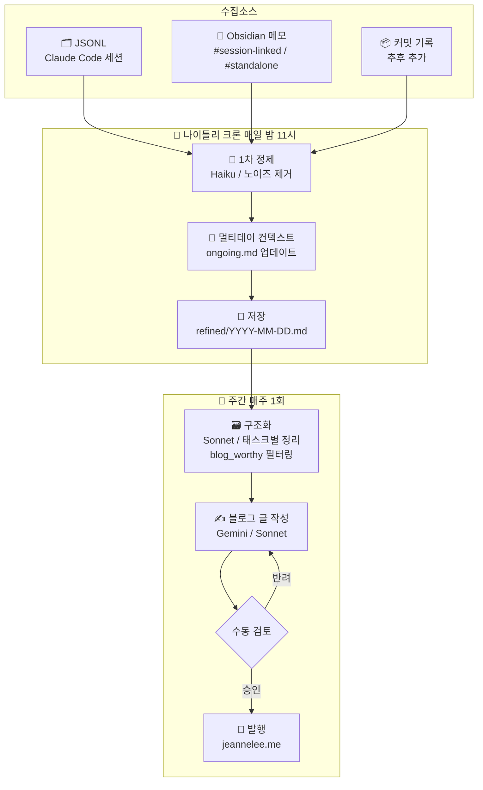

# Week 1 - jinhwa

## 아웃풋 목표

> 이번 파이프라인의 최종 결과물

- 한 주 동안 쌓인 Claude Code 세션 기록, 노트 기록 등을 자동으로 정리해 테크 블로그 글로 발행하는 시스템
- 최종 발행처: [jeannelee.me](https://jeannelee.me) (수동 승인 후 발행)

## 파이프라인 설계

> 전체 흐름



- **수집 소스 (우선순위 순)**:
  1. Claude Code 세션 로그 (`.claude/` 하위 `.jsonl` 파일)
  2. Obsidian 로컬 메모 (`.md` 파일 직접 읽기)
  3. 커밋 기록 / 기타 — 추후 추가
- **사용 툴/프레임워크**: Python (순수 스크립트) + Anthropic SDK + Gemini API, GitHub Actions (크론잡)
- **발행 채널**: jeannelee.me, 발행 방식은 수동 승인 후 포스팅

## 이번 주 진행 내용

- 파이프라인 전체 흐름 설계
- 오케스트레이션 툴 선정: Python
- JSONL 수동 정제 + 블로그 글 작성 프로토타입 수동 테스트 완료
  - Haiku로 노이즈 제거 → Sonnet으로 태스크별 구조화 → Gemini로 블로그 글 작성
- 프롬프트 초안 작성 (Haiku용 / Sonnet용 / Gemini용 각각)

## 프롬프트 초안

<details>
<summary>1단계 - Haiku (노이즈 제거)</summary>

```
이 로그에서 ANSI 이스케이프 코드, 프로그레스 바, 단순 파일 리스팅 등 기술적 맥락과 상관없는 노이즈를 모두 제거해.
오직 사용자와 AI의 대화 텍스트와 실행된 명령어, 수정된 코드 블록만 남겨서 시간순으로 정렬해줘.
```

</details>

<details>
<summary>2단계 - Sonnet (구조화)</summary>

```
이 로그를 바탕으로 다음과 같은 사항들을 정리해주세요.
1. 이 세션에서 이뤄진 작업의 목표
2. 그 목표에 수반되는 세부 태스크들
3. 2에서 정리된 각 태스크별로: 주요 태스크의 내용 / 디버깅 과정 / 유저가 겪은 주요 어려움 / 관련된 주요 키워드나 개념
이런 사항들을 하나의 md 문서로 정리해주세요.
```

</details>

<details>
<summary>3단계 - Gemini (블로그 글 작성)</summary>

```
3년차 주니어 개발자 톤, 겸손하고 학습 의욕이 충만한 말투, ~니다 경어체.
구조: 목표 → 세부 태스크 → 태스크별 문제 해결 과정(소개/어려움/배운 것) → 결론.
각 태스크의 "배운 것"은 외부 CS 배경지식을 활용해 관련 개념 정리.
과장 없이 진솔하고 담담하게. 태스크별로 나눠서 작성.
```

</details>

## 구현 중 막힌 것 / 해결한 것

| 문제                                               | 해결 여부 | 메모                                                        |
| -------------------------------------------------- | --------- | ----------------------------------------------------------- |
| 생성된 글에 하지 않은 내용이 포함됨 (환각)         | 해결 중   | Sonnet 프롬프트에 `[USER]` / `[AI]` actor를 명시적으로 태깅 |
| AI가 사용자를 지적하는 방식으로 서술됨 (역할 혼동) | 해결 중   | Gemini 프롬프트에 역할 제약 명시 예정                       |
| 생성 결과물을 손으로 직접 수정해야 했음            | 해결 중   | 프롬프트 정교화로 개선 후 재검증 필요                       |

## 인사이트 / 배운 것

- JSONL 로그에는 ANSI 코드, 프로그레스 바 등 노이즈가 많아 정제 단계가 필수
- 블로그 글 작성 모델에 문체/톤/구조를 명시적으로 지정해야 원하는 결과가 나옴
- 문체 학습: few-shot sample/fine tuning
  - 파인튜닝용 데이터는 input(구조화 요약)/output(블로그 글) 쌍이 필요 — 지금은 output만 있어 파인튜닝 부적합, 이번 파이프라인으로 생성한 글들이 쌓이면 그때 고려
- Obsidian은 로컬 `.md` 파일로 저장되어 Python 연동이 Notion보다 훨씬 단순함

## 다음 주 계획 및 고민되는 것들

### 1. JSONL 수집 자동화

- `.claude/` 하위 `.jsonl` 파일 탐색 및 읽기 스크립트 작성
- 마지막으로 처리한 파일 기록 → 중복 수집 방지 (처리 완료 파일 트래킹)
- 고려할 것: 세션이 여러 개일 때 어떤 기준으로 묶을지 (날짜? 프로젝트?)

### 2. 정형화 에이전트 개선

- Sonnet 프롬프트에 `[USER]` / `[AI]` actor 명시적 태깅 추가
- Gemini 프롬프트에 역할 제약 추가 ("AI는 도구, 주체는 개발자")
- 개선 전/후 결과물 비교해서 실제로 환각/역할 혼동이 줄었는지 검증

### 3. Obsidian 연동 설계

- Obsidian vault 경로 설정 → `.md` 파일 읽기 스크립트 작성
- **세션 매핑 방식 설계**: 노트마다 Claude 세션과 연결할지 독립 콘텐츠로 쓸지 구분 필요
  - 구상 방안: 태그로 구분 — `#session-linked` / `#standalone`

### 4. 콘텐츠 필터링 기준 설계

- 블로그로 쓸 만한 것과 아닌 것을 어떻게 걸러낼지
  - **쓸 만한 것**: 문제를 정의하고 해결한 과정이 있는 것, 새로 배운 개념이 있는 것, 삽질의 원인과 해결이 명확한 것
  - **아닌 것**: 단순 설정/세팅, 반복 작업, 내용이 너무 짧은 세션 (<500 토큰 등 기준 설정)
  - 방안: Sonnet 구조화 단계에서 `"blog_worthy": true/false` 필드 포함하도록 프롬프트 설계

### 5. 일일 1차 정제 크론잡 설계

- 매일 밤 자동으로 당일 JSONL + Obsidian 메모를 Haiku로 1차 정제 후 로컬에 저장
- 저장 포맷 예시: `refined/2026-03-27.md`
- 주간 블로그 작성 시에는 이미 정제된 파일들을 Sonnet에 넘겨 구조화만 하면 됨 → 비용/시간 절감
- GitHub Actions cron: `0 23 * * *` (매일 밤 11시)

### 6. 멀티데이 컨텍스트 이어가기

**Obsidian의 경우**: 같은 노트에 날짜별로 계속 추가하면 되므로 자연스럽게 해결됨

**Claude 세션의 경우**: JSONL 파일이 세션마다 독립적으로 생성되어 연결 고리가 없음 → 별도 설계 필요

- 방안 A: Obsidian을 브릿지로 활용
  - 멀티데이 작업이면 Obsidian에 대응 노트 만들고 frontmatter에 관련 세션 파일명 기록
  ```
  ---
  sessions: [abc123.jsonl, def456.jsonl]
  status: ongoing
  ---
  ```

  - 파이프라인이 `sessions` 필드 보고 해당 JSONL들을 묶어서 처리
- 방안 B: 세션 시작 발화 활용 — "어제 이어서 ~"라고 말하면 JSONL에 맥락이 남음, 나이틀리 크론이 주제 유사도 기반으로 이전 날 파일과 병합
- 방안 C: `context/ongoing.md` 누적 요약 유지 — 나이틀리 크론이 미완료 감지 시 append, 다음 날 정제 시 컨텍스트로 주입
- 고려할 것: 작업 완료 시점 감지 방법 (수동 태그 vs 자동 감지), 방안 A+B 조합이 현실적인 시작점
