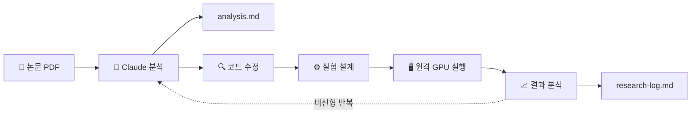

# Week 1 - kyungseop

## 아웃풋 목표

- Claude Code 기반으로 ML 연구자를 위한 EzAudio TTA 연구 파이프라인 구축
- 산출물: GitHub 레포 (research-claude)

## 파이프라인 설계

- **수집 소스**: 논문 PDF, GitHub 원본 코드, 원격 서버 실험 결과
- **사용 툴/프레임워크**: Claude Code (Opus), oh-my-claudecode (architect, quality-reviewer 에이전트)
- **발행 채널**: GitHub 레포

## 이번 주 진행 내용

- 초기 파이프라인 설계 및 구축 (폴더 구조, CLAUDE.md, 템플릿)
- architect 에이전트로 검토 → 구조적 문제 7개 발견 → 전면 리팩토링 수행
  - 문서 8개 → research-log.md 1개로 통합
  - 폴더 기반 실험 관리 → git branch 전략으로 변경
  - 선형 4단계 → 비선형 반복 모델로 개편
- quality-reviewer로 재검증 → 실행 레벨 버그 3개 추가 수정

## 구현 중 막힌 것 / 해결한 것

| 문제 | 해결 여부 | 메모 |
|------|-----------|------|
| 초기 설계가 개발자 패턴(선형, 문서화 우선)으로 ML 연구에 부적합 | ✅ | architect 에이전트로 문제 발견, 구조 리팩토링으로 해결 |
| baseline.yaml이 EzAudio 실제 config와 불일치 | ✅ | 원본 config 분석 후 실제 형식에 맞게 교체 |
| 리팩토링 후 구버전 파일 참조 잔존 | ✅ | quality-reviewer로 전수 검사 후 제거 |

## 인사이트 / 배운 것

- **선형 vs 비선형**: 개발자로서 항상 선형 모델(Phase 1→2→3→4)로 파이프라인을 설계했는데, ML 연구는 근본적으로 비선형 반복이었다. 논문 읽기 → 프로토타입 → 실험 → 결과 안 좋음 → 다시 논문 → 방향 전환... 이 사이클이 수십 번 반복된다. 특히 이번 프로젝트의 연구 방식은 기존 모델에서 개선점을 발견하고 검증하는 반복 과정이라 더욱 그렇다. 따라서 연구 파이프라인을 설계할 때는 '단계별 구조'가 아니라 '언제든 어디로든 돌아갈 수 있는 구조'가 필요하다.
- **멀티 에이전트 검증의 효과**: architect(구조 레벨) → quality-reviewer(실행 레벨) 순서로 2번 검토했는데, 1차에서는 'src/improved 폴더 분리가 연구에 안 맞다' 같은 설계 문제 7개를, 2차에서는 'eval.py가 존재하지 않는다', 'baseline.yaml로 학습 실행하면 KeyError 난다' 같은 실행 버그 3개를 각각 잡아냈다. 관점이 다른 에이전트를 순차적으로 투입하면 단일 관점으로는 놓치는 문제를 레이어별로 걸러낼 수 있다.
- **도메인 밖 설계 시 AI 에이전트 활용**: 내가 연구자가 아니다 보니 초기 설계에 개발자 편향이 강하게 들어갔다 — 문서화 우선 원칙, 선형 Phase 게이트, 폴더 기반 버전 관리 등 전부 소프트웨어 개발 패턴이었다. architect 에이전트에게 "실제 ML 연구 워크플로우와의 갭을 분석해달라"고 요청하니, 내가 모르는 도메인의 관행(branch per experiment, W&B 연동, 실험 재현성 등)을 구체적으로 짚어줬다. 자신이 전문가가 아닌 영역의 파이프라인을 설계할 때, AI에게 '이 설계가 실제 현장에서 어떤 식으로 일치하지 않는지'를 질문하는 것 자체가 강력한 보완 수단이 된다.

## 다음 주 계획

- Figma MCP + Notion MCP를 활용한 이력서 개선 AI 파이프라인 구축
