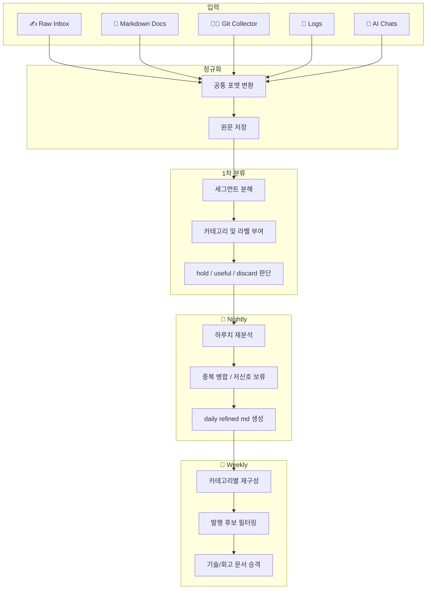

# Week 1 - seokbeom

## 아웃풋 목표

> 이번 파이프라인의 최종 결과물입니다.

- 제가 남긴 다양한 입력(채팅, 일기, 생각, 코드 작업 기록, 커밋, 에러 로그, 명령어, 메모, 문서 등)을 AI가 분석해 **카테고리별 Markdown 문서**로 재구성하는 시스템을 만드는 것이 목표입니다.
- 입력 시점에는 최대한 자유롭게 기록하고, 구조화와 재배치는 AI가 후처리합니다.
- 최종 결과물은 다음과 같이 나뉩니다.
  - 개인 diary
  - 주제별·프로젝트별 정리 문서
  - 일간·주간 회고 문서
- 장기적으로는 기술/코드 카테고리는 기술 블로그로, 일기/생각 카테고리는 별도 채널로 연결하는 것을 고려합니다.

---

## 이 시스템이 풀고 싶은 문제

저는 생각, 일기, 코드 작업 내용, 업무 메모, 에러 로그, AI와의 대화, 순간적인 단상까지 모두 남기고 싶습니다.  
하지만 이런 기록은 형식이 제각각이고, 하나의 입력 안에 여러 주제가 섞이는 경우가 많습니다.

- **입력은 자유롭게 하고, 정리는 나중에 합니다.**
- **입력 단위와 지식 단위는 다릅니다.**
- **잡탕 메모를 그대로 두지 않고 의미 단위로 분해해 다시 배치해야 합니다.**
- **짧고 정보량이 낮은 입력은 즉시 확정하지 않고 보류할 수 있어야 합니다.**

---

## 핵심 설계 원칙

### 1. Capture now, structure later

입력 단계에서는 일단 남기는 것이 중요합니다.  
구조화와 분류는 이후 단계에서 처리합니다.

### 2. 분류와 최종 반영은 다릅니다

짧은 문장도 분류는 가능하지만, 곧바로 최종 문서에 반영할 필요는 없습니다.  
예를 들어 `오늘 저녁 메뉴 치킨 먹음` 같은 문장은 `reflection` 계열 신호로 볼 수는 있어도, 단독으로는 핵심 회고가 되기 어렵습니다.

### 3. 입력 진입점은 적게, 해석 경로는 여러 개로 둡니다

사용자는 가능한 한 적은 진입점으로 기록해야 합니다.  
대신 시스템 내부에서는 하나의 입력을 여러 카테고리와 토픽으로 나눌 수 있어야 합니다.

### 4. 원문은 반드시 보존합니다

AI가 재구성한 결과만 남기면 나중에 출처 검증이나 재처리가 어렵습니다.  
따라서 raw 입력은 항상 함께 보관합니다.

### 5. 배치 재정리를 기본 전제로 둡니다

실시간 완성보다 아래 구조가 더 적합합니다.

- 입력 직후에는 약한 분류만 수행합니다.
- nightly 배치로 하루치 기록을 재정리합니다.
- weekly 배치로 의미 있는 문서와 발행 후보를 승격합니다.

---

## 시스템의 핵심 3축

이 시스템은 크게 **Input / Classification / Output** 세 층으로 구성됩니다.

### 1. Input

다양한 원천 데이터를 최대한 마찰 없이 수집합니다.  
입력 단계에서는 카테고리를 강제하지 않습니다.

### 2. Classification

입력 데이터를 의미 단위로 분해하고, 카테고리와 보조 라벨을 붙인 뒤, 목적에 맞는 후처리 경로로 보냅니다.

### 3. Output

최종 결과는 카테고리별 Markdown 문서로 생성합니다.  
필요하면 발행 후보 문서나 프로젝트 문서로도 승격합니다.

---

## 파이프라인 설계

> 전체 흐름입니다.

---

## Input 설계

### 입력 원칙

- 사용자는 형식을 고민하지 않고 기록할 수 있어야 합니다.
- 입력 시점에 카테고리를 고르게 하지 않습니다.
- 짧은 메모, 긴 문서, 로그, 코드, 명령어, 채팅 모두 허용합니다.
- 자동 수집 가능한 데이터는 최대한 자동화합니다.

### 초기 입력 소스 우선순위

1. **Raw Inbox**
   - 직접 아무거나 적는 단일 진입점입니다.
2. **Git Collector**
   - 커밋, 변경 파일, diff summary 등 코드 작업 기록을 수집합니다.
3. **Markdown / Text 문서**
   - 기존 md/txt 문서를 재사용합니다.
4. **AI 채팅 로그**
   - 문제 해결 과정과 설계 고민을 담은 중요한 입력원입니다.
5. **로그 / 명령어 / 에러 출력**
   - 기술 문제 해결 맥락을 보존합니

---

## Classification 설계

### 핵심 아이디어

문서 전체를 한 번에 하나의 종류로 판단하지 않고, **세그먼트 단위로 분해한 뒤 분류**합니다.  
즉 문서 단위 분류보다 **의미 단위 분류**를 우선합니다.

### 처리 단계

1. **정규화**
   - 모든 입력을 공통 schema로 변환합니다.
2. **세그먼트 분해**
   - 한 입력 안에 섞인 여러 주제를 분리합니다.
3. **1차 약한 분류**
   - `tech_issue`, `work_update`, `idea`, `reflection`, `todo`, `noise`
4. **처리 목적 결정**
   - `debug_structure`, `reflection_summary`, `task_extract`, `knowledge_note`, `idea_expand`
5. **전용 프롬프트 적용**
   - 카테고리별 전용 포맷터를 적용합니다.
6. **승격 판단**
   - raw 보관, nightly 반영, topic/project note 승격, publish candidate 전송 여부를 결정합니다.

---

## 짧고 정보량이 낮은 입력 처리 원칙

모든 입력을 즉시 최종 Markdown 문서에 반영하지는 않습니다.

예를 들어 아래와 같은 입력은 단독으로는 정보량이 낮습니다.

- 오늘 치킨 먹음
- 좀 피곤합니다
- 이거 뭔가 이상합니다
- 졸립니다

이런 입력은 다음처럼 다룹니다.

- 원문은 저장합니다.
- 약한 분류는 바로 수행합니다.
- `hold / useful / discard` 후보를 판단합니다.
- 같은 날의 다른 기록과 합쳐 다시 의미를 평가합니다.

---

## 처리 타이밍 전략

### Immediate Capture

- 사용자가 무엇을 입력하든 즉시 저장합니다.
- 원문은 보존합니다.
- 아주 얕은 라벨만 부여합니다.

### Nightly Consolidation

- 하루치 raw 입력을 재분석합니다.
- 세그먼트를 병합하고 중복을 줄입니다.
- low-signal 입력은 보류합니다.
- `processed/daily/YYYY-MM-DD.md`를 생성합니다.

### Weekly Promotion

- 일주일 동안 누적된 결과를 다시 재구성합니다.
- 반복된 주제는 topic/project note로 승격합니다.
- 기술 카테고리는 블로그 후보로, 회고 카테고리는 회고 문서로 정리합니다.

---

## Output 설계

### 내부 정리용 md

- `processed/daily/2026-03-27.md`
- `processed/topics/webex.md`
- `processed/projects/moai.md`
- `processed/reflection/2026-W13.md`

---

## 구현 시 예상되는 리스크

| 문제 | 설명 | 대응 아이디어 |
|---|---|---|
| 입력 형식이 제각각입니다 | chat, git, md, log 구조가 모두 다릅니다 | 공통 schema를 둡니다 |
| 한 입력 안에 여러 주제가 섞입니다 | 문서 단위 분류 정확도가 낮아집니다 | 세그먼트 단위 분해를 우선합니다 |
| 짧은 입력은 정보량이 부족합니다 | 즉시 반영 시 품질이 떨어집니다 | hold 후 nightly 재평가합니다 |
| 오분류가 후속 처리에 영향을 줍니다 | 잘못된 프롬프트 적용 가능성이 있습니다 | confidence와 보수적 분류를 사용합니다 |
| 카테고리가 과도하게 늘어날 수 있습니다 | 시스템 복잡도가 높아집니다 | 상위 카테고리는 단순하게 유지합니다 |

---

## 다음 주 계획 및 고민되는 것들

### 1. Raw Inbox 포맷 확정

- 하루 단위 파일로 갈지
- 단일 append 파일로 갈지
- 채팅 기반 수집과 병행할지 결정해야 합니다

### 2. Git Collector 프로토타입

- 특정 repo 또는 다중 repo 수집 범위를 정해야 합니다
- 오늘 커밋 기준과 이번 주 커밋 기준을 분리할지 검토해야 합니다
- diff를 어느 수준까지 저장할지 결정해야 합니다

### 3. nightly / weekly 산출물 포맷 설계

- `processed/daily/YYYY-MM-DD.md` 구조를 정해야 합니다
- 발행 후보 필터 기준과 민감도 기준을 함께 정의해야 합니다

### 4. OUTPUT 문서 설계

---

## 한 줄 요약

이 시스템은 **제가 아무거나 던져 넣을 수 있는 입력 환경**을 만들고,  
그 입력을 AI가 **의미 단위로 분해해 카테고리별 문서와 발행 후보로 재구성**하도록 만드는 개인 기록 운영 시스템입니다.
