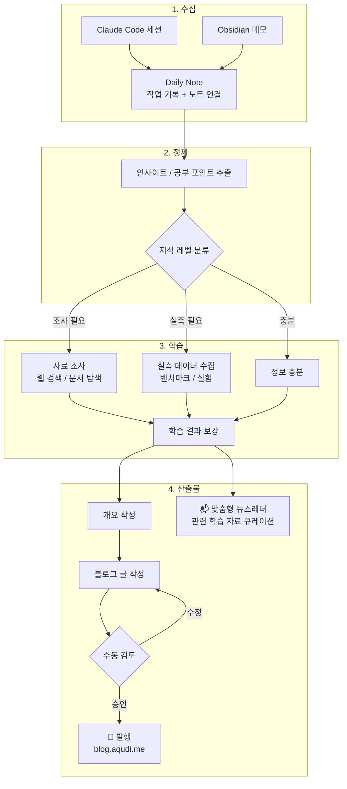

# Week 1 - taejung

## 아웃풋 목표

- 한 주간 일하면서 배운 것들, 생각한 것들을 모아 기술 블로그 글감 뽑고 -> 학습 자료, 블로그 글로 만드는 파이프라인
- 작업/학습한 내용을 바탕으로 더 공부해야 할 것을 조사해서 보내주는 맞춤형 뉴스레터 제작
  - 해당 지식이 필요한 순간에 학습이 가장 잘 이뤄지므로, 작업 직후 관련 자료를 큐레이션해서 전달
  - 공부할 내용을 나한테 대신 던져주고 나는 받아먹기만 할 수 있는 구조 만들기
- 최종 발행처: [blog.aqudi.me](https://blog.aqudi.me)
- 뉴스레터는 고민중

## 파이프라인 설계

- **수집 소스**: Claude Code 세션 로그, Obsidian 메모 (daily note를 허브로 활용)
- **발행 채널**: [blog.aqudi.me](https://blog.aqudi.me)

### 지식 레벨 분류 기준

| 레벨           | 판단 기준                                       | 다음 액션            |
| -------------- | ----------------------------------------------- | -------------------- |
| 정보 충분      | 이미 알고 있거나 세션 내에서 해결 완료          | 바로 개요 작성으로   |
| 자료 조사 필요 | 개념은 알지만 깊이가 부족하거나 레퍼런스가 필요 | 웹 검색 / 문서 탐색  |
| 실측 필요      | 성능, 비교, 수치 등 직접 측정해야 근거가 됨     | 벤치마크 / 실험 수행 |

## 이번 주 진행 내용

- 파이프라인 전체 흐름 설계 (수집 → 정제 → 학습 → 산출물 4단계)
- Claude Code 스킬을 만들어서 Claude Mem MCP에 적재된 내용 + Claude Code Session History를 모아 Obsidian Daily Note에 적재하는 프로세스 구축
  - 현재는 수동 트리거 방식으로 동작

## 구현 중 막힌 것 / 해결한 것

| 문제                                              | 해결 여부 | 메모                                         |
| ------------------------------------------------- | --------- | -------------------------------------------- |
| 여러 컴퓨터에 나뉘어 있는 작업은 어떻게 수집하지? | 미해결    | 노션 같은 클라우드 서비스에 넣어볼까 생각 중 |
| 작업 로그 수집을 어떻게 자동화하지?               | 미해결    | 크론잡 같은 걸 넣어야 하나?                  |

### 고민되는 것

- 어느 정도 알아야 글로 쓸 수 있는 건지?
- 완전 자동화가 가능하다고 생각하는지?

## 인사이트 / 배운 것

- Claude 세션에 생각보다 많은 데이터가 쌓인다는 걸 알게 됐다. 정제 단계 없이는 글감으로 바로 쓰기 어려울 정도로 양이 많아서, 지식 레벨 분류 같은 필터링이 필수적이라고 느꼈다.

## 다음 주 계획

- 일한 내용, 공부한 내용을 지식 단위로 쪼개기
- 매일 자동으로 작업 로그를 쌓게 하기
- 더 공부할 내용도 자동으로 뽑아서 주기
