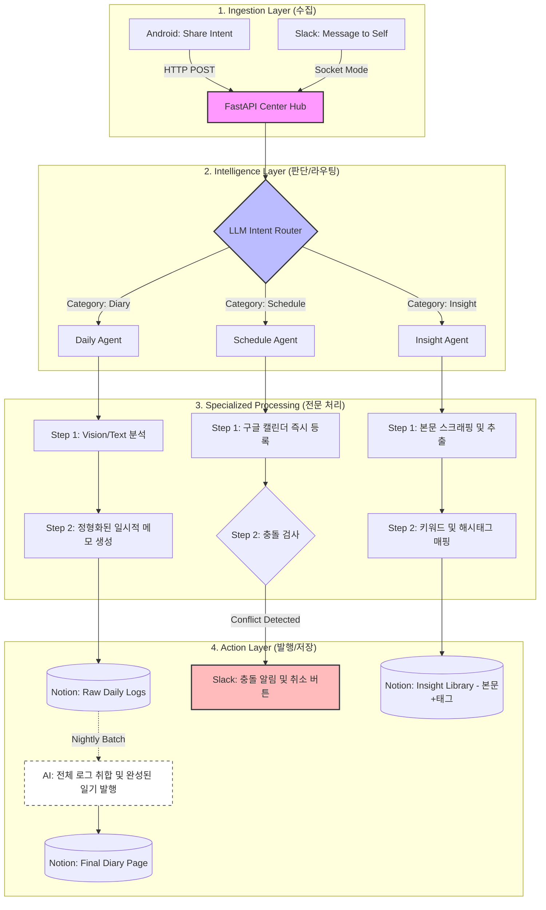

# Week 1 - yongmin

## 아웃풋 목표

> 이번 파이프라인의 최종 결과물

- 사용자가 평소에 텍스트 및 이미지를 던지면 능동적으로 "일기발행/일정관리/인사이트정리"를 해주는 시스템 (인생 짬통 만들기)
- 최종 발행처: 노션

## 파이프라인 설계

> 전체 흐름

- **수집 소스 (우선순위 순)**:
  - 사용자가 직접 데이터 입력. 일상 속에서 남기고 싶은 내용을 텍스트/이미지 형태로 던짐. 모바일의 경우 공유 기능으로, PC의 경우 슬랙에 던지기
- **사용 툴/프레임워크**: Python + FastAPI + LangGraph + Pydantic V2 + Slack SDK + Notion SDK + Android + AI(모델 안 정함)
- **발행 채널**: 노션 (수동/자동 고민 중)

## 이번 주 진행 내용

- 파이프라인 전체 흐름 설계
- Slack 연결 및 분류 모델에게 데이터 전달

## 구현 중 막힌 것 / 해결한 것

| 문제                                                         | 해결 여부 | 메모                                                         |
| ------------------------------------------------------------ | --------- | ------------------------------------------------------------ |
| 다 처음하는 것들이라 굉장히 AI 의존적임                      | 해결중    | 차차 구현해나가면서 이해도를 넓혀나가야함                    |
| 기술 스택을 AI가 작성해줬는데 정말 필요한 건지 아직 잘 모름. | 해결 중   | 각 단계를 수행하며 고민 후 결정 예정                         |
| 갤럭시 S26의 나우넛지 같은 기능을 기대했지만, 불가능해서 데이터를 사용자가 직접 넘겨야함. | 해결불가  | 지금까지의 생각으로는 Framework단을 건드리지 않고서는 해결 불가능 |

## 인사이트 / 배운 것

- 현재는 노션에 저장할 예정이지만, 추후 나의 일기나 인사이트를 검색 용이하게 디벨롭하려면 자체 저장소를 사용해야할 수도 있겠다?
- 데이터를 사용자의 노력 없이 수집해오는 것은 굉장히 어렵다...

## 다음 주 계획 및 고민되는 것들

### 1. 데이터 분류하기

사용자가 넘긴 데이터가 일기/일정/인사이트 중 무엇인지 판단하기

### 2. 일기 Agent 건드리기

현재 굉장히 추상적으로 적어놨기 때문에 일기를 작성할 AI agent를 어떻게 만들어야할지 알아보기.