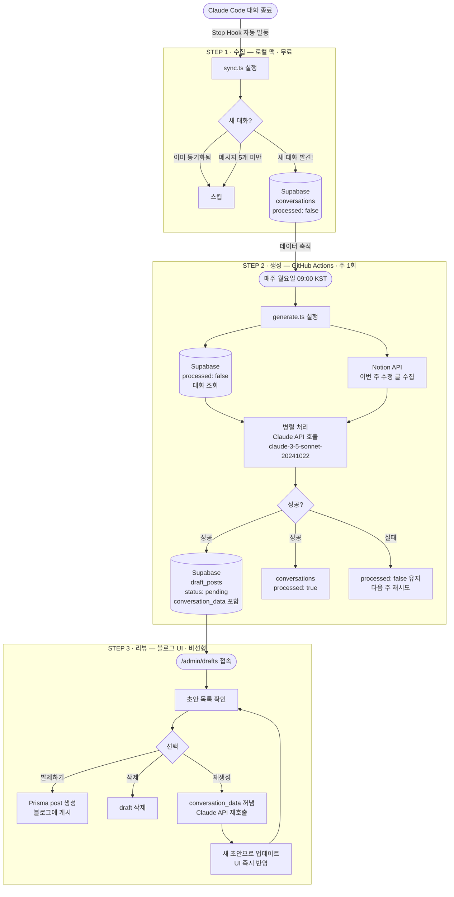
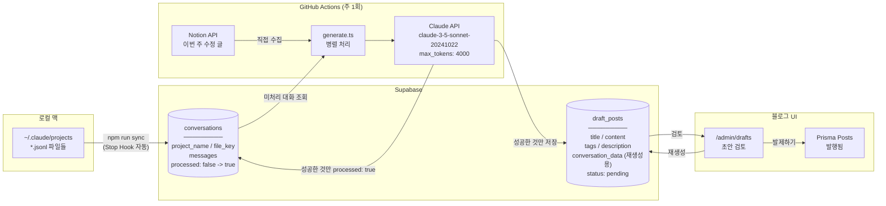
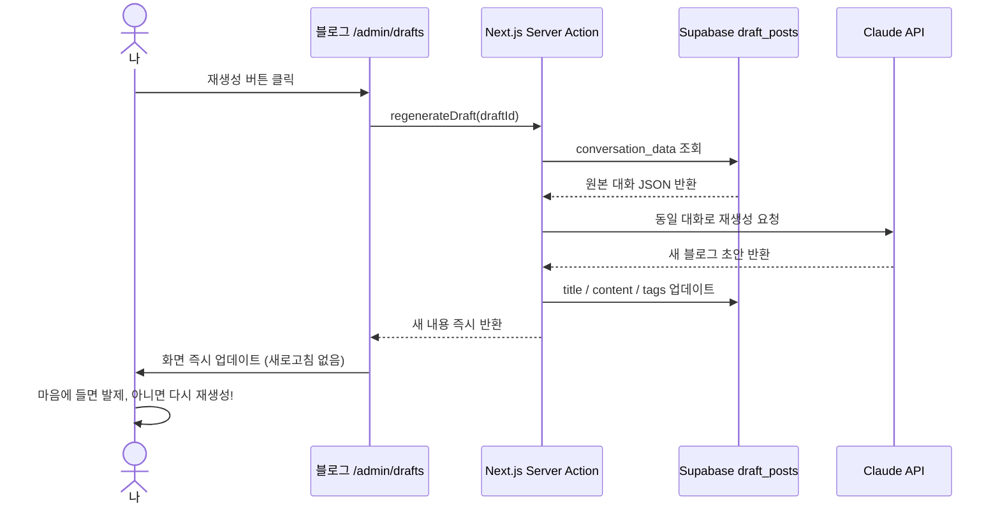

# Week 2 - hongbi

## 아웃풋

> 1주차에 설계한 파이프라인을 실제로 구현 완료

- Claude Code Stop Hook으로 대화 종료 시 자동 동기화
- GitHub Actions로 매주 월요일 초안 자동 생성
- 블로그 `/admin/drafts` UI에서 검토 → 발제 / 삭제 / 재생성

## 구현한 파이프라인



### 데이터 흐름



## 단계별 구현 내용

### STEP 1 — 수집 · sync.ts

- `~/.claude/projects/` 하위 JSONL 파일 순회
- 이미 동기화됐거나 메시지 5개 미만인 대화는 스킵
- 신규 대화만 Supabase `conversations` 테이블에 `processed: false`로 저장
- Claude Code **Stop Hook**에 등록해서 대화 끝날 때마다 백그라운드 자동 실행

```bash
bash setup-hook.sh  # 최초 1회 등록
```

### STEP 2 — 생성 · generate.ts

- Supabase에서 `processed: false` 대화 조회
- Notion API로 이번 주 수정된 페이지 수집
- 두 소스를 **병렬로** Claude API(`claude-3-5-sonnet-20241022`)에 전달해 초안 생성
- 성공한 항목만 `draft_posts`에 `status: pending`으로 저장, `processed: true` 처리
- 실패한 항목은 `processed: false` 유지 → 다음 주 자동 재시도
- **GitHub Actions**로 매주 월요일 09:00 KST 자동 실행

### STEP 3 — 검토 UI · /admin/drafts

- 초안 목록을 카드 형태로 표시
- **발제하기**: Prisma로 블로그 post 생성 후 게시
- **삭제**: draft 삭제
- **재생성**: `conversation_data`를 꺼내 Claude API 재호출 → 새 초안으로 즉시 업데이트 (새로고침 없음)



## 설계 결정 — 1주차에서 달라진 점

| 항목        | 1주차 계획                    | 실제 구현                                  |
| ----------- | ----------------------------- | ------------------------------------------ |
| 실행 환경   | 로컬 crontab                  | **GitHub Actions**                         |
| 수집 트리거 | 주 1회 crontab                | **Stop Hook** (대화 끝날 때마다)           |
| 모델        | claude-sonnet-4-6 (8000 토큰) | **claude-3-5-sonnet-20241022 (4000 토큰)** |

**crontab → GitHub Actions로 변경한 이유**

- STEP 1(sync)은 로컬 로그를 Supabase에 먼저 올려두고, STEP 2(generate)는 Supabase 데이터만 쓰면 되는 구조로 분리하니 서버에서도 실행 가능해짐
- 맥북이 꺼져 있어도 주 1회 초안 생성이 보장됨

**모델 변경 이유**

- claude-sonnet-4-6 대비 비용 약 50% 절감
- 자연스러운 블로그 글쓰기는 Sonnet 3.5가 더 잘 맞음

## 트러블슈팅

**Claude API 응답 파싱 실패**

- 모델이 JSON 앞뒤에 설명 텍스트를 붙이는 경우가 있음
- 응답에서 `[` ~ `]` 범위만 추출해서 파싱하도록 처리

## 다음 주 계획

- 실제 1주치 데이터로 end-to-end 테스트
- 초안 퀄리티 개선을 위한 프롬프트 튜닝
- 발행 후 알림 기능 추가 검토 (Slack 또는 노션)
