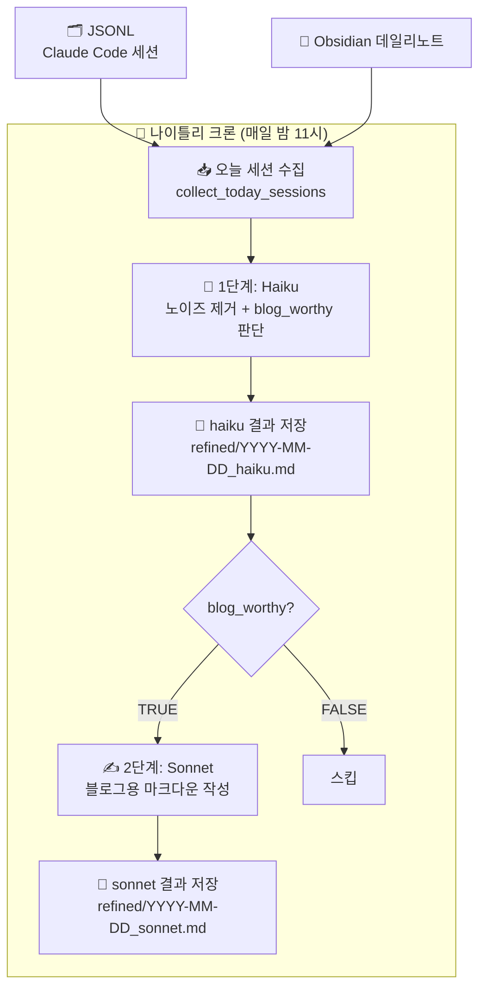

# Week 2 - jinhwa

## 아웃풋 목표

> 이번 주 구현 목표

- 나이틀리 크론잡 자동화: 매일 밤 Claude Code 세션 로그를 자동으로 수집·정제해 로컬에 저장
- `nightly_refine.py` 스크립트 작성 및 실제 실행 검증

## 파이프라인 설계

> 이번 주 구현한 나이틀리 크론 흐름



- **1단계 Haiku**: ANSI 코드·프로그레스 바 등 노이즈 제거, `[WORTHY: TRUE/FALSE]` 판단 포함
- **2단계 Sonnet**: blog_worthy가 TRUE일 때만 조건부 실행, 태스크별 구조화된 md 문서 생성
- **실행 환경**: macOS launchd / crontab + OAuth 토큰 환경변수 주입

## 이번 주 진행 내용

- `nightly_refine.py` 스크립트 작성 완료
  - `.claude/projects/` 하위 `.jsonl` 파일에서 오늘 날짜 메시지만 필터링해 수집
  - Haiku로 1차 정제 후 blog_worthy 판단 → Sonnet으로 2차 정리 (조건부)
  - Obsidian 데일리노트 연동: 오늘자 `.md` 파일을 읽어 프롬프트에 컨텍스트로 주입
  - `blog_worthy` 판단 결과를 Obsidian 노트 frontmatter에 자동 반영
  - 실행 로그(`execution.log`) 및 토큰 사용량 로그(`token_usage.log`) 기록
- 크론잡 등록 및 환경변수 문제 디버깅
  - crontab, macOS launchd 두 방식 모두 시도
  - OAuth 토큰 수동 추출 후 환경변수로 등록하는 방식으로 최종 해결
- 나이틀리 결과물 품질 검증 및 문제 발견

## 프롬프트 현황

<details>
<summary>1단계 - Haiku (노이즈 제거 + blog_worthy 판단)</summary>

```
이 로그에서 ANSI 이스케이프 코드, 프로그레스 바, 단순 파일 리스팅 등 기술적 맥락과 상관없는 노이즈를 모두 제거해.
오직 사용자와 AI의 대화 텍스트와 실행된 명령어, 수정된 코드 블록만 남겨서 시간순으로 정렬해줘.
그리고 마지막 줄에 반드시 [WORTHY: TRUE/FALSE] 형식으로 블로그 발행 가치를 판단해줘.

WORTHY 판단 기준 (우선순위 순):
1. 대화의 양: 오늘 오고 간 총 메시지 수가 30개 이상인가?
2. 문제 해결의 깊이: 문제를 정의하고 여러 번의 시도 끝에 해결한 과정이 있는가?
3. 지식의 가치: 새로 배운 개념(CS 지식 등)이 명확한가?
```

</details>

<details>
<summary>2단계 - Sonnet (블로그용 마크다운 작성)</summary>

```
다음 정제된 로그와 사용자의 업무일지를 바탕으로 블로그용 고퀄리티 마크다운 문서를 작성해줘.
1. 이 세션에서 이뤄진 작업의 목표
2. 그 목표에 수반되는 세부 태스크들
3. 2에서 정리된 각 태스크별로: 주요 태스크의 내용 / 디버깅 과정 / 유저가 겪은 주요 어려움 / 관련된 주요 키워드나 개념
이런 사항들을 하나의 md 문서로 정리해줘.
```

</details>

## 구현 중 막힌 것 / 해결한 것

| 문제                                                          | 해결 여부 | 메모                                                                                          |
| ------------------------------------------------------------- | --------- | --------------------------------------------------------------------------------------------- |
| 크론잡 실행 시 Claude CLI 로그인 실패 (환경변수 미로드)       | 해결      | OAuth 토큰을 직접 추출해 환경변수로 등록, cron/launchd 실행 환경에 명시적으로 주입           |
| macOS launchd로 전환해도 동일한 인증 오류                     | 해결      | 위와 동일한 방식으로 해결 (launchd plist에 환경변수 직접 기재)                               |
| 결과물에서 두 작업 주제가 뒤섞임 (태스크 미분리)             | 해결 중   | 세션 단위로 별도 파일로 만들어야 함                   |

## 새로 알게 된 것
- **launchd**: macOS에서 cron을 대체하는 공식 작업 스케줄러. `~/Library/LaunchAgents/`에 `.plist` 파일(XML)을 등록하면 로그인 시 자동으로 로드됨
  - **문법**: cron은 `0 23 * * *` 같은 한 줄 표현식, launchd는 XML로 키-값 구조 명시 (`StartCalendarInterval` 딕셔너리로 시간 지정)
  - **실패 처리**: cron은 실패해도 조용히 넘어가지만 launchd는 `KeepAlive`, `ThrottleInterval` 등으로 재시도·억제 설정 가능
  - **macOS 통합도**: launchd는 macOS 부팅 프로세스의 일부(PID 1)라 시스템 이벤트 트리거, 로그 연동 등 cron보다 기능이 많음. macOS에서 장기 운용할 거라면 launchd 권장
- **cron/launchd 환경 격리**: 터미널에서 수동 실행할 때와 달리 cron·launchd는 최소 환경으로 실행되어 `~/.zshrc` 등이 로드되지 않음. 인증 토큰처럼 환경변수에 의존하는 CLI는 plist나 crontab에 직접 환경변수를 명시해야 함
- **OAuth 토큰 직접 주입**: Claude CLI의 인증 상태는 로컬 파일(토큰 캐시)에 저장되며, 이를 읽어 환경변수로 넘기는 방식으로 비대화형 환경에서도 인증 가능

  ```xml
  <!-- 예시: 매일 밤 11시 실행 -->
  <key>StartCalendarInterval</key>
  <dict>
      <key>Hour</key><integer>23</integer>
      <key>Minute</key><integer>0</integer>
  </dict>
  ```

## 다음 주 계획

### 1. 세션 단위 파이프라인으로 재설계

현재는 하루치 전체 로그를 하나로 합쳐서 처리하고 있어 여러 작업이 뒤섞이는 문제가 있음.
**각 `.jsonl` 파일 = 하나의 독립 작업**으로 보고, 세션 단위로 파이프라인 전체를 분리해서 처리하도록 재설계.

```
각 .jsonl 파일 (세션 = 작업 단위)
  → Haiku: 세션별 개별 정제 + blog_worthy 판단
  → refined/YYYY-MM-DD_{session-id}_haiku.md  (세션마다 별도 파일)
  → blog_worthy인 것만 → Sonnet: 세션별 개별 실행
  → refined/YYYY-MM-DD_{session-id}_sonnet.md
  → 블로그 글도 세션별 별도 생성
```

### 2. Obsidian 연동 설계 및 구현

**단방향 (세션 → Obsidian)** 으로 설계. 세션이 시작되는 시점에 Claude Code 훅으로 자동 생성.

**구현 방식: Claude Code `UserPromptSubmit` 훅**
- 세션이 열리고 첫 메시지가 제출되는 순간 훅 실행
- 훅 payload의 `session_id`와 첫 번째 사용자 메시지를 읽어 Obsidian 노트 즉시 생성
- 이미 생성된 노트가 있으면 스킵 (멱등)

생성되는 노트 구조:
```markdown
---
date: 2026-04-03
session: abc1234f.jsonl
blog_worthy: null
status: ongoing
---

# 첫 메시지 내용 (이 세션이 뭔지 사람이 식별할 수 있도록)
```

- **파일명**: `YYYY-MM-DD_{session_id[:8]}.md` → 날짜 + 해시 앞 8자리
- **세션 식별**: 해시만으론 무슨 작업인지 불투명하므로 첫 메시지를 본문에 포함해 사람과 파이프라인 모두 식별 가능하게
- 나이틀리 크론은 이 노트의 `session` 필드로 해당 JSONL을 찾아 sonnet 작업 시 참고 컨텍스트로 삽입


### 3. 주간 파이프라인 연결

- 나이틀리로 쌓인 `refined/*_sonnet.md`를 주 1회 묶어 블로그 글 초안 생성하는 위클리 스크립트 작성 시작
- 세션 단위로 쪼개졌으므로 위클리에서는 같은 주제의 세션들이 있다면 다시 묶는 로직 필요할 수도

## 여담

- 토큰이 부족해.. max 플랜이 필요하다
- 2026 ai-native 엔지니어링 트렌드, 평가 기준
