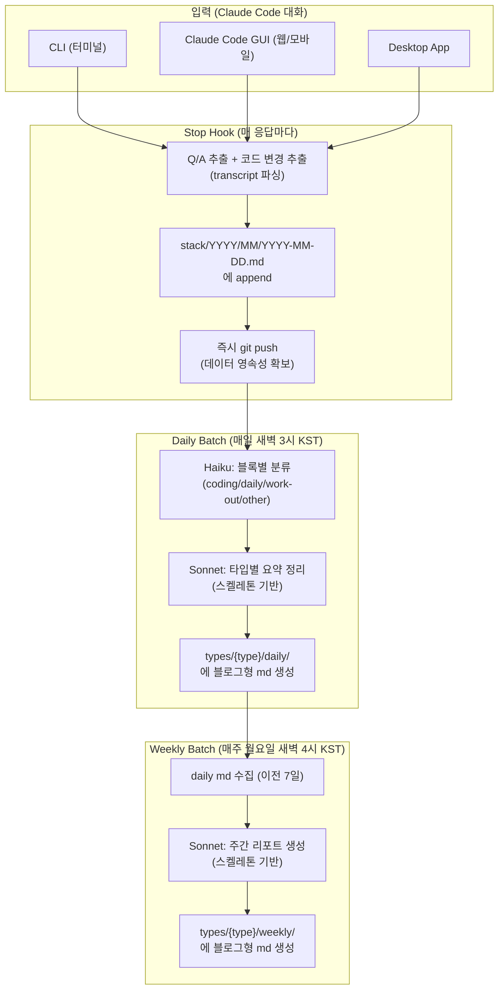

# Week 2 - seokbeom

## 아웃풋

> 1주차에 설계한 파이프라인을 실제로 구현 완료 + Claude Code GUI 기반 멀티 디바이스 환경 확보

- Claude Code Stop Hook으로 매 응답마다 대화 자동 수집 + 즉시 git push
- GitHub Actions로 매일/매주 자동 분류·요약 배치 실행
- Claude Code GUI를 활용해 브라우저·스마트폰에서도 동일하게 동작하는 환경 구축

## 구현한 파이프라인



## 단계별 구현 내용

### STEP 1 — 실시간 수집 (Stop Hook + 즉시 git push)

- Claude가 응답을 완료할 때마다 Stop Hook 자동 실행
- hook 데이터에서 마지막 Q/A 추출, transcript 파싱으로 코드 변경 내용(Edit/Write) 추출
- `stack/YYYY/MM/YYYY-MM-DD.md`에 append 후 **즉시 git push**
- Claude Code GUI가 git clone 기반으로 동작하기 때문에 hook도 그대로 작동

기록 형식:
```markdown
## 15:30 [type:unclassified]
**Q**: hook 경로 수정해줘

**A**: 경로를 수정했습니다.

**Changes**:
- `scripts/save_stack.sh`: `"bash scripts/save_stack.sh"` → `"bash ../../scripts/save_stack.sh"`
```

### STEP 2 — 일일 분류·요약 (Daily Batch, GitHub Actions)

- 매일 새벽 3시 (KST) 자동 실행
- **Haiku** — 전날 stack의 각 블록을 4개 타입 중 하나로 분류
- **Sonnet** — 타입별로 모인 블록을 `daily-skeleton.md` 기반으로 블로그형 요약 생성
- `types/{type}/daily/YYYY/MM/YYYY-MM-DD.md` 생성

### STEP 3 — 주간 리포트 (Weekly Batch, GitHub Actions)

- 매주 월요일 새벽 4시 (KST) 자동 실행
- 이전 7일간의 daily md 수집 (요약 부분만)
- **Sonnet** — `weekly-skeleton.md` 기반으로 주간 리포트 생성
- `types/{type}/weekly/YYYY/MM/start~end.md` 생성

### 모델 사용 전략

| 단계 | 모델 | 용도 | 비용 |
|------|------|------|------|
| 분류 | Haiku | 블록별 타입 분류 | 저렴 (블록당 1회) |
| 일일 요약 | Sonnet | 스켈레톤 기반 정리 | 중간 (타입당 1회) |
| 주간 요약 | Sonnet | 블로그형 리포트 | 중간 (타입당 1회) |

## 핵심 설계 결정

### 왜 매 응답마다 즉시 git push 하는가

- Claude의 컨텍스트 저장을 신뢰할 수 없음 — 세션이 끊기거나 컨텍스트가 압축되면 데이터 유실 가능
- git push를 통해 **매 응답마다 확실하게 데이터를 영속화**
- 이 구조 덕분에 GitHub Actions 배치가 항상 최신 데이터를 기반으로 동작

### 왜 Claude Code GUI에 초점을 맞췄는가

- Claude Code GUI는 git repo를 clone해서 실행하는 구조
- 따라서 `.claude/settings.json`에 등록된 Stop Hook이 GUI에서도 그대로 동작
- 브라우저·스마트폰에서도 터미널과 완전히 동일한 파이프라인이 작동
- 디바이스 제약 없이 어디서든 대화하면 자동으로 기록이 쌓이는 환경 확보

### 왜 첫 수집(stack)에 LLM을 쓰지 않는가

- Claude Code GUI가 git 기반으로 동작해야 하므로, 수집 단계에서 외부 API 호출 의존성을 넣으면 환경 제약이 생김
- Stop Hook은 **bash 스크립트로 정규식 기반 추출**만 수행 — LLM 없이 빠르고 안정적
- LLM 처리는 이후 GitHub Actions 배치 단계에서 수행

## 향후 과제

### 수집 단계 정규화 개선

- 현재 Stop Hook이 transcript에서 Q/A와 코드 변경을 추출하지만, 불필요한 정보가 섞이거나 핵심이 빠지는 경우가 있음
- 정확히 필요한 내용만 깔끔하게 추출하는 정규화 로직 고도화 필요

### 일간·주간 요약 프롬프트 튜닝

- 현재 스켈레톤 기반으로 요약을 생성하고 있으나, 결과물의 퀄리티를 더 높이고 싶음
- 타입별로 프롬프트를 정교하게 다듬어서 블로그 수준의 자연스러운 글 생성 목표

## 프로젝트 구조

```
ai-agent/
├── .claude/
│   └── settings.json                    # Stop hook 설정 (git root)
├── .github/
│   └── workflows/
│       ├── classify-stack.yml           # Daily 분류 배치
│       └── weekly-summary.yml           # Weekly 요약 배치
├── cli/
│   ├── ai-agent/                        # 이 시스템 자체에 대한 대화
│   └── work/                            # 프로젝트 작업 대화
├── scripts/
│   ├── save_stack.sh                    # Stop hook → 대화 + 코드 변경 저장 + git push
│   ├── classify_stack.sh                # Daily 배치 → 분류 + 요약
│   └── weekly_summary.sh               # Weekly 배치 → 주간 리포트
├── stack/                               # 날짜별 raw 대화 로그 (자동 생성)
│   └── YYYY/MM/YYYY-MM-DD.md
├── types/                               # 타입별 분류 기준 + 스켈레톤 + 결과
│   ├── coding/
│   ├── daily/
│   ├── work-out/
│   └── other/
└── README.md
```
