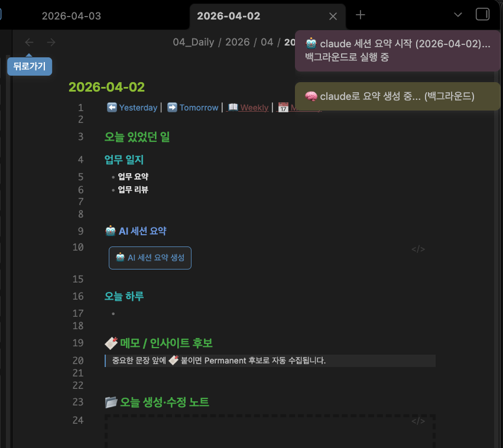
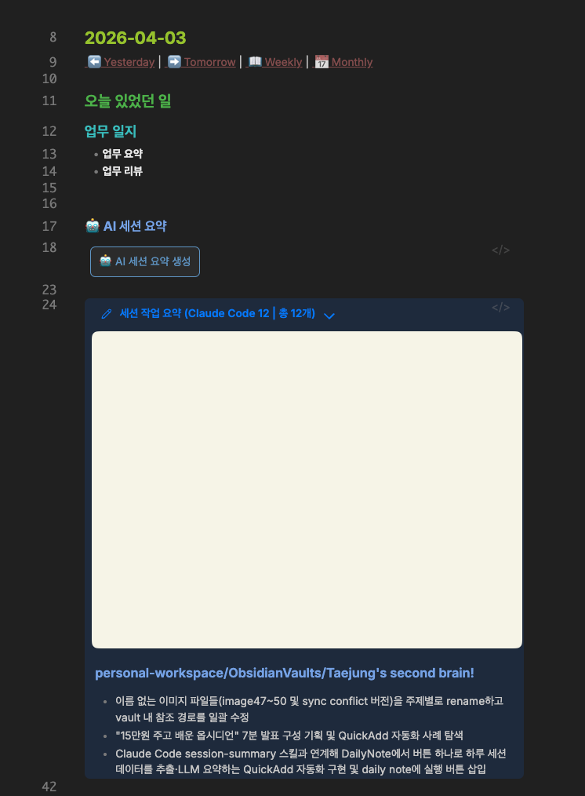
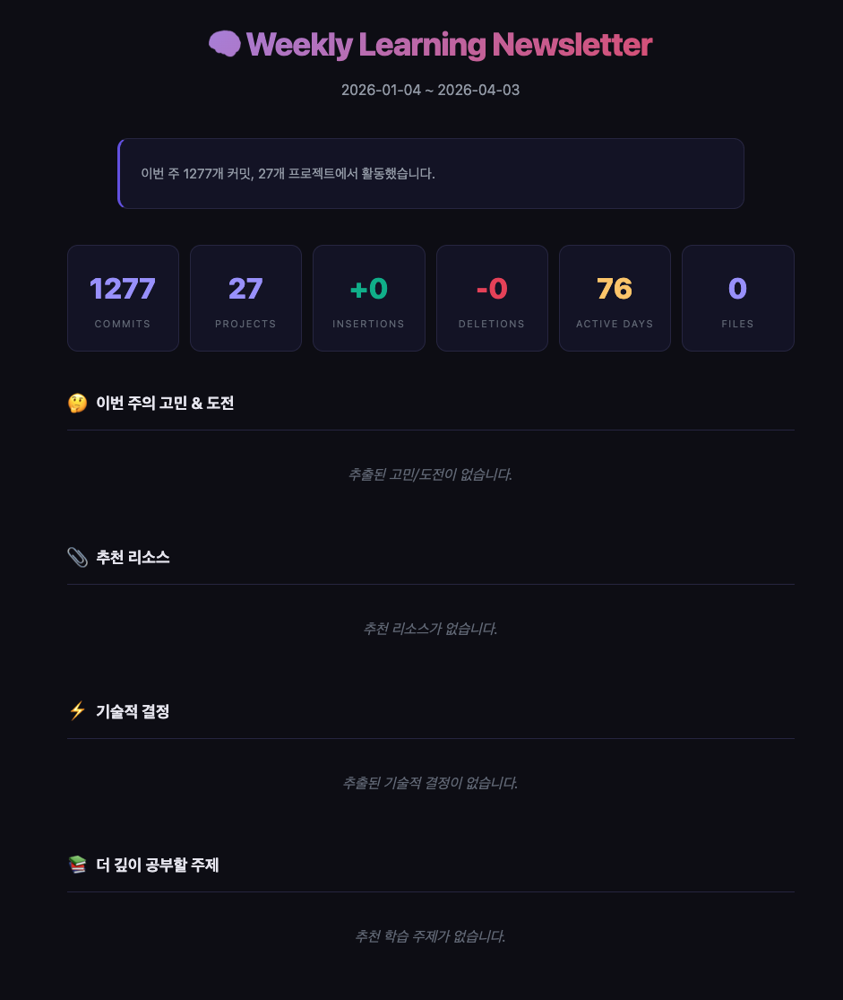

# Week 2 - taejung

## 이번 주 주제

Claude Code의 `session-summary` 스킬을 리팩터링하여, 하루 작업 요약의 품질을 개선한 과정과 결과 & 옵시디언에 넣는 방식 개선한 내용 공유

## 1주차의 문제점

Session Summary 스킬로 하루 작업을 요약하면 **너무 피상적인 수준의 요약**이 나왔다. (사실상 쓸모 없는 수준이었다.)

### 원인 분석

- 세션 로그에서 일부 대화만 발췌하는데, **AI의 응답이 사용자 입력보다 압도적으로 많다**
- AI가 "자기가 뭘 했는지"를 장황하게 설명하는 텍스트가 주력 데이터가 됨
- 결과적으로 **내 의도와 목적이 요약에 담기지 않는** 문제가 발생

> 요약에 Oh-My-ClaudeCode 내용이 너무 많이 들어가서 내가 뭘 했는지가 잘 안보임

## 보완한 방법

### 1. 데이터 품질 개선

| 변경 사항      | Before      | After                                                 |
| -------------- | ----------- | ----------------------------------------------------- |
| git log 수집   | 없음        | 추가 — 커밋 메시지가 "내가 뭘 완료했는지"의 핵심 근거 |
| 노이즈 필터링  | 없음        | `!awssso`, `[Pasted text]` 같은 의미 없는 입력 제거   |
| AI 응답 비중   | 주력 데이터 | 보조 컨텍스트로 강등                                  |
| 사용자 입력 수 | 8개         | 12개로 확대                                           |
| 수정 파일 수   | 8개         | 12개로 확대                                           |

**핵심 아이디어**: AI 응답을 줄이고, 사용자 입력과 git log를 늘려서 "내가 뭘 했는지"가 드러나도록 데이터를 추가했다.

### 2. 요약 프롬프트 변경

|        | Before                  | After                                                            |
| ------ | ----------------------- | ---------------------------------------------------------------- |
| 관점   | 세션 내용               | **내가** 뭘 했는지, 뭘 하고 싶었는지                             |
| 지시문 | "프로젝트별 2-3줄 요약" | "내가 오늘 뭘 했는지 관점, 목적과 결과 중심, 커밋을 핵심 근거로" |
| 초점   | 작업 내역 나열          | 목적과 달성 결과                                                 |

## 결과 비교

### Before (1주차)

```
- CRM 백엔드의 로깅 및 인덱스 최적화를 위한 **RALPLAN 합의 플래닝** 진행 — Planner → Architect → Critic 3단계 리뷰 수행
- Critic이 REJECT 판정: Fastify 내장 pino 로거를 무시한 console wrapper 재발명, 로그 호출 918건을 285건으로 오기재한 범위 산정 오류, LOG_LEVEL=warn과 CLAUDE.md 지침 충돌 등 지적 → v2플랜 재수립
```

→ "뭘 건드렸는지"만 나열. 왜 했는지, 뭘 달성했는지 알 수 없음.

### After (2주차)

```
#### 프로젝트1
- A의 commons 모듈 구조를 참고해 CRM 백엔드의 로깅 개선 계획 수립
- 단순 debug 로그 제거가 아닌 logger 도입 + log level 제어까지 포함한 v2 플랜을 RALPLAN consensus 모드로 정제하여 Obsidian 프로젝트 노트로 정리
- `B` 모듈 등록 커밋으로 공통 모듈 분리 작업 착수

#### 프로젝트2
- 병원 생성 시 대표원장/직원 생성을 동기적으로 처리한 뒤 이벤트를 발행하도록 트랜잭션 흐름을 재설계
- `createUser` 내부 트랜잭션을 제거하고 호출자가 트랜잭션을 관리하도록 리팩터링, 불필요한 변수 제거
- 나이 범위(0~150) 예외 케이스 처리 추가
- 정렬 기준(활성 → 만료 → 비활성) 및 필터 옵션 개선, G티켓 기반으로 커밋 재작성
- backend-commons 분리 계획 및 H에픽 Jira 티켓 누락 여부 검토

#### personal-workspace/ObsidianVaults/Taejung's second brain!
- 이름 없는 이미지 파일들(image47~50 및 sync conflict 버전)을 주제별로 rename하고 vault 내 참조 경로를 일괄 수정
- Claude Code session-summary 스킬과 연계해 DailyNote에서 버튼 하나로 하루 세션 데이터를 추출·LLM 요약하는 QuickAdd 자동화 구현 및 daily note에 실행 버튼 삽입
```

→ **왜 했는지**(피상적 요약 문제), **뭘 달성했는지**(목적 중심 요약으로 전환)가 드러남.

## 옵시디언 자동화
버튼을 만들어서 누르면 local claude, codex cli를 사용해서 백그라운드로 자동화하는 스크립트를 만들어봤다. 

<details>
<summary>자세히</summary>




</details>

## 학습 뉴스레터 시도

- 90일치 데이터를 모아서 시도 중인데 계속 실패중이다.



## 인사이트 / 배운 것

- 데이터가 별로니까 요약 결과도 별로였다.
- `claude --output-format json --json-schema analysis_schema.json --permission-mode bypassPermissions`, `codex exec --json --full-auto -o text.txt "HI"`로 다른 cli 도구처럼 noninteractive 모드로 쓸 수 있다.
- 기존 도구랑 통합하려니까 별로인 것 같다. 이 작업을 위한 별도의 격리된 공간이 있는 게 좋을 것 같다.
- 생각보다 한 주 동안 흥미로운 일이 없었던 것 같다.
