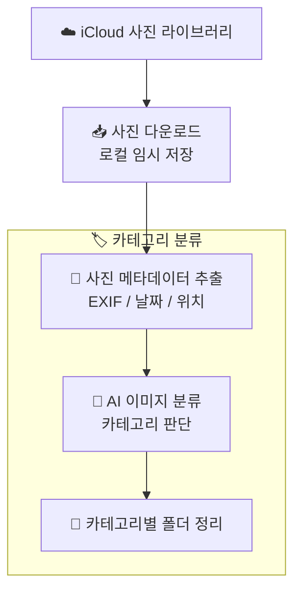

# Week 2 - unan

## 아웃풋 목표

> iCloud 사진 라이브러리에서 사진을 가져와 카테고리별로 자동 분류하는 파이프라인 구현

- iCloud 사진 라이브러리 접근 및 사진 다운로드
- AI 기반 카테고리 분류 자동화
- 분류된 사진을 폴더 구조로 정리

## 파이프라인 설계

> iCloud → 다운로드 → 분류 → 정리

## 이번 주 진행 내용

- iCloud 사진 라이브러리 접근 방식 조사
  - `pyicloud` 라이브러리를 활용한 iCloud 인증 및 사진 목록 조회
  - 2FA 인증 처리 흐름 구현
- 사진 다운로드 스크립트 작성
  - 날짜 범위 필터링으로 필요한 사진만 선별 다운로드
  - 중복 다운로드 방지를 위한 캐싱 처리
- 카테고리 분류 로직 설계
  - EXIF 메타데이터(날짜, 위치, 카메라 정보) 기반 1차 분류
  - AI 모델을 활용한 이미지 내용 기반 2차 분류 (풍경, 인물, 음식, 문서 등)
- 분류된 사진을 카테고리별 디렉토리 구조로 자동 정리

## 구현 중 막힌 것 / 해결한 것

| 문제 | 해결 여부 | 메모 |
| --- | --- | --- |
| iCloud 2FA 인증 자동화 | 해결 중 | 세션 토큰 캐싱으로 재인증 빈도 줄이는 방식 시도 |
| 대량 사진 다운로드 시 API rate limit | 해결 | 배치 처리 + 지수 백오프로 안정적 다운로드 구현 |
| 카테고리 분류 정확도 | 진행 중 | 메타데이터 + AI 분류를 조합해 정확도 향상 중 |

## 다음 주 계획

- 분류 정확도 개선을 위한 프롬프트 튜닝
- 분류 결과 리뷰 UI 또는 리포트 생성
- 자동 실행을 위한 스케줄링 (cron 또는 launchd) 설정
