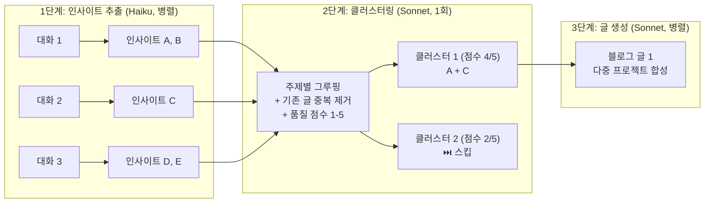

# Week 3 - hongbi

## 아웃풋

> 2주차에 구현한 파이프라인의 AI 처리 방식을 근본적으로 개선

- JSON 파싱 오류 원천 차단 → Tool Use 방식으로 전환
- 대화 노이즈 제거 + 1단계 가치 판별 추가
- 대화 단위 처리에서 **인사이트 클러스터링** 방식으로 전환 (핵심 개선)
- 클러스터별 품질 점수 필터링으로 낮은 품질 초안 자동 제거
- GitHub Actions Job Summary로 실행 결과 가시성 확보

---

## 개선 1 — 노이즈 제거 + 1단계 가치 판별

### 배경

기존에는 대화 전체를 그대로 Sonnet에 전달. 코드 덩어리, 짧은 응답, 가치 없는 대화도 전부 API 비용 소모.

### cleanConversationText — 노이즈 제거

인사이트 추출 전 대화 텍스트를 정제.

````typescript
function cleanConversationText(conversation: ProjectConversation): string {
  const cleaned = messages
    .filter((m) => m.text.length > 20) // 20자 이하 제거 ("네", "감사합니다" 등)
    .map((m) => {
      // 500자 이상 코드블록 → 생략 처리
      text.replace(/```(\w*)\n([\s\S]*?)```/g, (match, lang, content) => {
        if (content.length < 500) return match;
        return `\`\`\`${lang}\n[코드 블록 생략]\n\`\`\``;
      });
      // 2000자 초과 메시지 → 1500자로 트림
      if (text.length > 2000) text = text.slice(0, 1500) + "\n...(생략)";
    });

  // 40개 초과 시 앞 20개 + 뒤 20개만 유지
  return cleaned.length > 40
    ? [
        ...cleaned.slice(0, 20),
        "...(중간 생략)...",
        ...cleaned.slice(-20),
      ].join("\n\n")
    : cleaned.join("\n\n");
}
````

### isWorthBlogging — 1단계 가치 판별

Haiku로 빠르게 yes/no 판단. 가치 없으면 Sonnet 호출 자체를 안 함.

```typescript
async function isWorthBlogging(
  text: string,
  projectName: string,
): Promise<boolean> {
  const res = await client.messages.create({
    model: "claude-haiku-4-5-20251001",
    max_tokens: 50,
    // "yes" 또는 "no" 만 응답
  });
  return res.text.trim().toLowerCase().startsWith("yes");
}
```

**흐름:**

```
대화 수집
  → cleanConversationText (노이즈 제거)
  → isWorthBlogging (Haiku) → no면 스킵
  → generateDraftPosts (Sonnet) → 초안 저장
```

---

## 개선 2 — 인사이트 클러스터링 파이프라인 (핵심)

### 기존 방식의 문제

```
대화1 → 블로그 글1
대화2 → 블로그 글2   ← 같은 주제 중복 가능
대화3 → 블로그 글3
```

대화 단위로 쪼개면 맥락이 단편적이고, 비슷한 주제가 여러 개 나올 수 있음.

### 새 파이프라인

```
[conv1] ─┐
[conv2] ─┼─→ 인사이트 추출(Haiku, 병렬) → 전체 클러스터링(Sonnet, 1회) → 클러스터별 글 생성(Sonnet, 병렬)
[conv3] ─┘
```

**새 데이터 흐름:**

```
Conversation[]
  → Insight[][]   // 대화당 핵심 포인트들
  → InsightCluster[]  // 주제별로 묶음
  → DraftPost[]   // 클러스터당 블로그 글
```

### 구현



**인터페이스:**

```typescript
interface Insight {
  topic: string;
  summary: string;
  techStack: string[];
  sourceProject: string;
  excerpt: string;
}

interface InsightCluster {
  theme: string;
  angle: string; // 어떤 관점으로 쓸지
  qualityScore: number; // 1-5, 3 미만은 생성 스킵
  insights: Insight[];
}
```

**효과:**

- 여러 프로젝트에서 같은 주제 다룬 내용 → 하나의 깊은 글로 합성
- 가치 없는 대화는 Haiku 단계에서 컷 → Sonnet 비용 절감
- Sonnet 클러스터링 1회 호출에서 품질 점수도 같이 매김 → 추가 비용 없음

---

## 개선 3 — 품질 점수 필터링

### 배경

기존에는 "인사이트 있음 / 없음"만 판단. 얕거나 일반적인 내용도 글 생성 단계까지 도달해 Sonnet 비용 낭비.

career-ops 참고: A-F 점수 매겨서 낮은 건 자동 제외하는 방식.

### 구현

`clusterInsights` Tool Schema에 `qualityScore(1-5)` 필드 추가. **3점 미만 클러스터는 글 생성 자체를 스킵.**

```typescript
// clusterInsights Tool Schema
{
  name: "cluster_insights",
  input_schema: {
    properties: {
      clusters: {
        items: {
          properties: {
            theme: { type: "string" },
            angle: { type: "string" },
            qualityScore: { type: "number", description: "블로그 가치 1-5점" },
            insightIndexes: { type: "array" },
          }
        }
      }
    }
  }
}

// 3점 미만 클러스터 필터링
const worthyClusters = clusters.filter((c) => c.qualityScore >= 3);
```

```
클러스터 생성 (Sonnet, 1회)
  └─ qualityScore 4/5 ✅ → 글 생성
  └─ qualityScore 2/5 ⏭️ → 스킵 (Sonnet 호출 없음)
```

---

## 개선 4 — GitHub Actions Job Summary

### 배경

현재는 stdout 로그만 있어서 Actions 탭에서 실행 결과를 바로 알 수 없음.

### 구현

`generate.ts` 끝에서 `$GITHUB_STEP_SUMMARY` 파일에 append. 로컬 실행 시엔 환경변수가 없으므로 자동 스킵.

```typescript
if (process.env.GITHUB_STEP_SUMMARY) {
  const summary = [
    `## 블로그 초안 자동 생성 결과\n`,
    `**${allDrafts.length}개** 초안 생성 완료 🎉\n`,
    `| 제목 | 소스 프로젝트 | 태그 |`,
    `|---|---|---|`,
    ...allDrafts.map(
      (d) => `| ${d.title} | ${d.sourceProject} | ${d.tags.join(", ")} |`,
    ),
  ].join("\n");

  fs.appendFileSync(process.env.GITHUB_STEP_SUMMARY, summary);
}
```

**Actions 탭에서 보이는 결과:**

```
## 블로그 초안 자동 생성 결과

**3개** 초안 생성 완료 🎉

| 제목 | 소스 프로젝트 | 태그 |
|---|---|---|
| TypeScript 타입 추론 정리 | auto-blog-posting | TypeScript, 타입추론 |
| React 상태관리 비교 | blog, side-project | React, Zustand |
```

---

## 개선 전후 비교

| 항목           | 2주차                         | 3주차                           |
| -------------- | ----------------------------- | ------------------------------- |
| JSON 파싱      | 텍스트 파싱 → 특수문자에 취약 | Tool Use 강제 → 파싱 오류 없음  |
| 노이즈 처리    | 없음                          | 코드블록 압축, 짧은 메시지 제거 |
| 가치 판별      | 없음 (전부 Sonnet 호출)       | Haiku yes/no → 가치 없으면 스킵 |
| AI 처리 단위   | 대화 1개 → 글 1개             | 전체 인사이트 → 클러스터 → 글   |
| 품질 관리      | 없음                          | qualityScore 3점 미만 자동 스킵 |
| 실행 결과 확인 | stdout 로그만                 | Actions Job Summary 표 형태     |

---

## 다음 주 계획

- 직접 사용 후 수정해야할 파이프라인 있다면 개선하기
- 토큰이 너무 아깝다.. 사용해보고 크게 와닿지 않는 토큰 사용범위는 줄여야겠다.
- 맥미니 m4 gemma4 로컬 세팅 (가능하다면)
