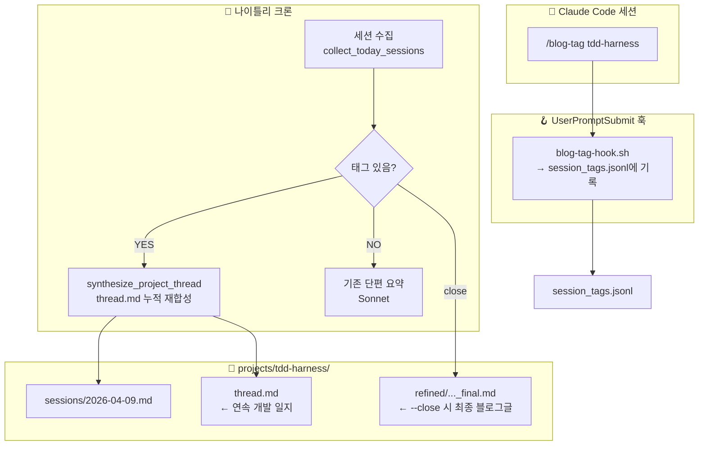

# Week 3 - jinhwa

## 아웃풋 목표

> 이번 주 구현 목표

- 블로그 글 품질 문제의 근본 원인 진단 및 파이프라인 개편 설계
- 멀티데이 컨텍스트 지원: 여러 세션에 걸친 작업을 하나의 블로그 글로 엮어내는 구조 구현

## 문제 진단

> 기존 파이프라인의 한계

기존 `nightly_refine.py`는 **오늘 하루의 JSONL만** 파싱해서 단편 요약을 생성함.
회사에서 며칠에 걸쳐 진행하는 작업(예: TDD 하네스 파이프라인 개편)이 날마다 별개의 글로 쪼개져
작업의 맥락과 서사가 사라지는 문제 발생.

핵심 원인: **멀티데이 컨텍스트 부재**. 파이프라인이 세션 간 연관성을 인식하지 못함.

## 개편안 검토

세 가지 방향을 검토 후 A안으로 결정:

| 안 | 핵심 아이디어 | 채택 여부 |
|---|---|---|
| **A. 프로젝트 스레드 레지스터** | `projects/<name>/thread.md`에 세션 누적·재합성, 완결 시 발행 | **채택** |
| B. 롤링 컨텍스트 윈도우 | 최근 N일 refined 파일을 함께 프롬프트에 투입 | 보류 (장기 프로젝트에 취약) |
| C. 옵시디언 에피소드 태그 | 옵시디언 노트에 에피소드명 태그, 파이프라인이 이를 읽어 묶음 | 보류 (세션보다 옵시디언에 최적화) |

A안에서 자동 분류 대신 **세션 내 명시적 커맨드**로 태깅하는 방식 채택 (자동 분류의 오분류 리스크 제거).

## 파이프라인 설계

## 이번 주 진행 내용

### 1. `/blog-tag` 슬래시 커맨드

- `~/.claude/commands/blog-tag.md` 생성
- 세션 중 언제든 `/blog-tag <project-name>` 또는 `/blog-tag <project-name> --close` 사용 가능
- `--close`: 해당 프로젝트의 모든 누적 세션을 하나의 최종 블로그 글로 생성하는 트리거

### 2. `blog-tag-hook.sh` + settings.json 훅 등록

- `UserPromptSubmit` 이벤트에 훅 등록
- `/blog-tag` 패턴 감지 시 `context/session_tags.jsonl`에 즉시 기록
  - 저장 필드: `session_id`, `transcript_path`(JSONL 경로), `project`, `close`, `timestamp`
- `transcript_path`의 파일 stem으로 나이틀리 스크립트와 매핑

### 3. `nightly_refine.py` 개편

**구조 변경**:
- `session_data` 값이 `str` → `{"content": str, "jsonl_stem": str}` 딕셔너리로 변경
- `load_session_tags()` 함수 추가: sidecar JSONL에서 stem → 프로젝트 매핑 로드
- `synthesize_project_thread()` 함수 추가: 프로젝트 스레드 누적 재합성 로직

**라우팅 로직** (우선순위):
1. 훅 sidecar(`session_tags.jsonl`)에서 `jsonl_stem`으로 태그 조회
2. 없으면 세션 텍스트에서 `/blog-tag` 패턴 직접 탐지 (폴백)
3. 태그 없는 세션 → 기존 단편 요약 방식 유지

**프로젝트 스레드 합성 로직**:
- 태그된 세션 → `projects/<name>/sessions/<date>.md`에 raw 저장
- 기존 `thread.md` + 오늘 세션 → Sonnet으로 재합성 → `thread.md` 업데이트
- `--close` 시 → 전체 sessions/*.md 취합 → 완결된 블로그 글 생성 → `refined/..._final.md`

## 구현 중 막힌 것 / 해결한 것

| 문제 | 해결 여부 | 메모 |
|---|---|---|
| JSONL 파일이 어떻게 파싱되는지 불확실 | 해결 | 유저 메시지가 텍스트 그대로 기록됨 확인 (실제 JSONL 검증) |
| 훅에서 현재 세션 JSONL 파일을 어떻게 특정하나 | 해결 | `UserPromptSubmit` 페이로드의 `transcript_path`로 직접 매핑 가능 |
| session_data 구조 변경으로 인한 기존 로직 깨짐 | 해결 | 딕셔너리로 래핑, 기존 단편 요약 분기는 `content` 키로 동일하게 접근 |

## 새로 알게 된 것

- **`UserPromptSubmit` 훅 페이로드**: `session_id`, `transcript_path`, `prompt` 포함. `transcript_path`로 현재 세션의 JSONL 파일을 직접 알 수 있음
- **이중 저장 패턴**: 훅(sidecar) + JSONL 텍스트 탐지를 병행해 단일 실패 지점 제거. 훅이 실패해도 텍스트 폴백으로 동작
- **슬래시 커맨드 파일**: `~/.claude/commands/*.md`에 정의하면 Claude가 해당 커맨드의 의도와 응답 방식을 인식. 원본 텍스트는 JSONL user 메시지에 그대로 기록됨

## 다음 주 계획

### 1. `weekly_publish.py` 개편

- 현재: `refined/*_sonnet.md`를 개별 발행
- 목표: `refined/*_final.md` (프로젝트 최종 글)을 우선 처리하는 로직 추가
- `thread.md`도 미리보기용으로 PR에 포함할지 검토

### 2. 프로젝트 목록 관리 UI

- 현재 어떤 프로젝트가 진행 중인지, 몇 개 세션이 쌓였는지 파악할 방법 없음
- `/blog-status` 커맨드: 현재 활성 프로젝트 스레드 목록 + 각 세션 수 출력

### 3. 실전 검증

- 실제 작업 세션에서 `/blog-tag` 사용해 파이프라인 end-to-end 검증
- `thread.md` 품질 평가: 며칠치 세션이 쌓였을 때 서사가 자연스럽게 이어지는지 확인
