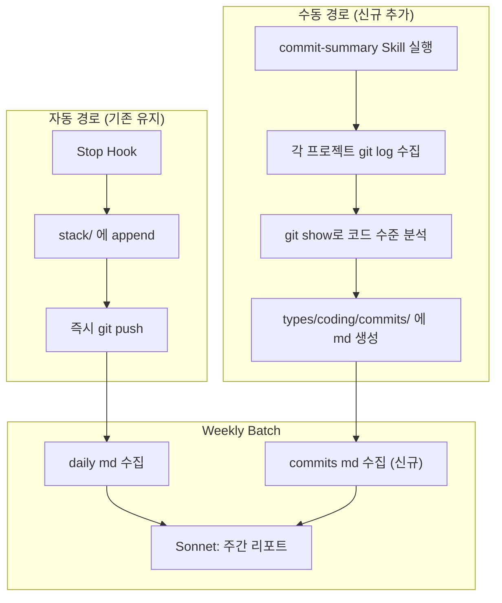

# Week 3 - seokbeom

## 아웃풋

> Hook 기반 자동 수집의 한계를 파악하고, Claude Code Skill 기반 수동 커밋 분석 파이프라인을 추가하여 트래킹 커버리지를 보완

- Stop Hook의 1000자 제한 및 세션 병합 문제로 인한 데이터 유실 확인
- `commit-summary` Skill을 추가하여 git commit 기반으로 전체 작업 내용을 코드 수준까지 분석·정리
- Max Plan 토큰을 활용하여 별도 API 과금 없이 대량 분석 가능한 구조 확보
- 주간 요약 배치에서 Skill 출력물도 함께 참조하도록 파이프라인 확장

## 발견한 문제

### Stop Hook 데이터 수집 한계

| 문제 | 상세 |
|------|------|
| **1000자 저장 제한** | Hook에 전달되는 응답 데이터가 기본 1000자로 잘림. Claude는 한 번에 방대한 내용을 처리하지만 실제 저장되는 건 극히 일부 |
| **Ultra Plan 세션 병합** | Ultra Plan + Agent 팀 구성 시, 내부적으로 세션을 공유하며 하나의 채팅으로 처리됨. 별도 세션으로 분리되지 않아 stack에 제대로 쌓이지 않는 문제 발생 |
| **트래킹 사각지대** | 위 두 문제가 결합되면 하루 작업량의 상당 부분이 누락됨 |

### 문제의 본질

Hook 기반 자동 수집만으로는 **전체 작업 내용을 온전히 트래킹하기 어렵다**는 구조적 한계. Hook은 가볍고 자동이라는 장점이 있지만, 정보 완결성이 부족.

## 해결 — commit-summary Skill 추가

기존 Hook 파이프라인은 그대로 유지하면서, **git commit 기반 수동 분석 경로를 병행**하는 구조로 확장.



### commit-summary Skill 동작 방식

1. `CLAUDE.md`에 등록된 전체 프로젝트 경로를 동적으로 파싱
2. 각 프로젝트에서 `git log --all --no-merges --author="justin"` 으로 커밋 수집
3. 브랜치 간 중복 제거 (cherry-pick/merge로 인한 동일 커밋 필터링)
4. **전체 커밋에 대해 `git show`로 실제 diff 확인** — 추가/수정된 클래스, 메서드, 엔드포인트 등 코드 수준 정보 포함
5. `types/coding/commits/YYYY/MM/{시작}_{종료}.md` 에 프로젝트별로 정리

### Skill 설계 시 의도적으로 넣은 것들

- **커밋 선별 없이 전체 분석**: 처음에는 "주요 커밋 10~15개 선별"로 토큰을 아끼려 했으나, Max Plan 토큰을 쓰는 거라 제한을 두지 않는 쪽으로 변경
- **커밋 타입 필터 없음**: feat/fix/refactor만 보는 게 아니라 chore, build 등 전체 커밋을 분석
- **날짜 구간 지정 지원**: `/commit-summary 2026-04-01` 또는 `/commit-summary 2026-04-01 2026-04-13` 형태로 자유롭게 구간 지정

### 주간 요약 파이프라인 확장

`weekly_summary.sh`에서 coding 타입 주간 리포트 생성 시, `types/coding/commits/` 의 커밋 정리 파일도 함께 수집하여 Sonnet에 전달하도록 수정. 기존 daily 요약만으로는 부족했던 코드 수준의 상세 내용이 주간 리포트에 반영됨.

## 비용 구조의 이점

| 방식 | 모델 | 과금 | 토큰 사용 |
|------|------|------|-----------|
| API 직접 호출 | Sonnet/Opus | 별도 API 결제 필요 | 제한적 사용 |
| **Skill (Max Plan)** | **Opus** | **Max Plan에 포함** | **자유롭게 사용 가능** |

- 1주일치 전체 커밋 분석 시 약 **10,000+ 토큰** 소모
- API로 동일 작업을 하면 별도 과금이 발생하지만, Skill은 Max Plan 안에서 해결
- 토큰을 아끼려 할 필요가 없으므로 **모든 커밋을 코드 수준까지 분석**하는 것이 가능

## 현재 파이프라인 전체 구조

```
ai-agent/
├── .claude/
│   └── settings.json                    # Stop hook 설정
├── .github/workflows/
│   ├── classify-stack.yml               # Daily 분류 배치
│   └── weekly-summary.yml               # Weekly 요약 배치
├── cli/
│   └── work/
│       ├── CLAUDE.md                    # 참조 프로젝트 목록 (Skill이 동적 파싱)
│       └── .claude/skills/
│           └── commit-summary/          # [신규] 커밋 분석 Skill
│               └── SKILL.md
├── docs/                                # [신규] 설정/인프라 문서
│  
│  
│   
├── scripts/
│   ├── save_stack.sh                    # Stop hook → 대화 저장 + git push
│   ├── classify_stack.sh                # Daily 배치 → 분류 + 요약
│   └── weekly_summary.sh               # Weekly 배치 → 주간 리포트 (commits 참조 추가)
├── stack/                               # 날짜별 raw 대화 로그
├── types/
│   ├── coding/
│   │   ├── commits/                     # [신규] Skill 출력 — 커밋 정리
│   │   ├── daily/
│   │   └── weekly/
│   ├── daily/
│   ├── work-out/
│   └── other/
└── README.md
```

## 향후 과제 (Week 4)

### 블로그 업로드 자동화

- 현재 `types/` 에 생성되는 daily/weekly md를 블로그에 자동 게시하는 파이프라인 구축 목표
- 블로그 글 생성 프롬프트 튜닝 — 현재 요약 톤이 딱딱하므로 자연스러운 블로그 말투로 개선
- 기존에 Velog(md 기반)를 사용했으나 **외부 업로드 API가 없어** 자동화 불가
- 대안 검토 중:
  - **홈서버 블로그**: 완전한 자유도, API 직접 구현 가능. 인프라 관리 부담
  - **티스토리**: 공식 API 존재, 자동화 용이. 커스터마이징 제한

### 수집 단계 정규화 개선 (계속)

- Hook 1000자 제한 우회 또는 보완 방안 탐색
- Skill 기반 수동 경로와 Hook 자동 경로의 데이터 중복/누락 최소화
