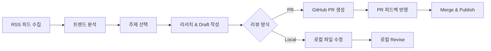

# Week 3 - taejung

## 이번 주 주제

지난 주 마무리하면서 AI만 쓰는 공간을 만들어야겠다고 했었는데 이번 주에 적용해봤습니다.

1. 옵시디언 Wiki 정리 — Andrej Karpathy의 LLM Wiki 방법론 적용
2. 블로그 자동화 파이프라인 구축 — RSS 피드 → 트렌드 분석 → draft 작성 → revise → publish

## 1. 개인 지식 관리 (옵시디언 정리) — LLM Wiki 방법론 적용

### LLM Wiki란?

Andrej Karpathy가 제안한 [LLM Wiki](https://gist.github.com/karpathy/442a6bf555914893e9891c11519de94f)는 **LLM이 점진적으로 구축하고 유지하는 구조화된 마크다운 위키**다.

**왜 나왔는가?**

기존 RAG(NotebookLM, ChatGPT 파일 업로드 등)는 질문할 때마다 원본에서 관련 청크를 검색한다. 종합적인 질문을 하면 매번 여러 문서를 다시 연결해야 하고, **지식이 축적되지 않는다**. Karpathy의 핵심 문제의식:

> "LLM은 매번 처음부터 지식을 재발견하는 중이다. 축적이 없다."

**3계층 구조**

```
1. Raw Sources  — 불변의 원본 자료 (사용자가 큐레이션)
2. Wiki         — LLM이 작성/관리하는 마크다운 파일 (요약, 개념 정의, 상호 참조)
3. Schema       — CLAUDE.md 같은 설정 문서 (LLM에게 작업 규칙 명시)
```

**핵심 작업 흐름**

| 작업            | 설명                                                                    |
| --------------- | ----------------------------------------------------------------------- |
| Ingest (수집)   | 새 소스 추가 → LLM이 읽고 요점 추출 → 기존 위키 10~15개 페이지 업데이트 |
| Query (질의)    | 위키 페이지를 검색·종합하여 답변 생성, 새 발견은 위키에 추가            |
| Lint (유지관리) | 모순, 오래된 내용, 고아 페이지, 누락된 연결 탐지 및 정리                |

**작동 원리** — 지식 관리의 지루하고 복잡하고 머리 아픈 부분(노트 사이의 링크, 여러 파일 동시 수정 등)을 LLM이 대신 처리하고, 인간은 소스 선택과 분석 방향만 담당하면 된다.

### 옵시디언에 적용 — `wiki-tools` Claude Code 플러그인

LLM Wiki 패턴을 옵시디언에 적용하기 위해 `wiki-tools`라는 Claude Code 플러그인을 직접 만들었다.

**스킬 4개**

| 스킬         | 호출                       | 역할                                                          |
| ------------ | -------------------------- | ------------------------------------------------------------- |
| wiki-ingest  | `/wiki-tools:wiki-ingest`  | 노트 → Wiki 페이지(Summary/Entity/Concept) 생성               |
| tag-classify | `/wiki-tools:tag-classify` | 노트에 Properties(para, status, source) + 주제 태그 자동 부여 |
| wiki-lint    | `/wiki-tools:wiki-lint`    | Wiki 건강 점검 (고아 페이지, 누락 참조, 야생 페이지)          |
| wiki-query   | `/wiki-tools:wiki-query`   | Wiki 기반 질의응답                                            |

**사용 흐름**

```
1. 캡처         사람이 아무 곳에나 노트 작성 (Inbox, Daily, Projects...)
                   ↓
2. Wiki Ingest  /wiki-tools:wiki-ingest 최근 10개 정리해줘
                   → Summary 페이지 필수 생성, Entity/Concept 선택 생성
                   → 원본에 wiki-ingested-at 마킹, _index.md·_log.md 부기
                   ↓
3. Tag Classify /wiki-tools:tag-classify 최근 20개 분류해줘
                   → para(resource/project/...), status(review-pending), 주제 태그 부여
                   → tag-classified-at 마킹
                   ↓
4. 사람 리뷰     Dashboard에서 status: review-pending 확인 → done으로 변경
                   ↓
5. 자동 이동     Auto Note Mover Plus 플러그인으로 para 값 기반으로 폴더 이동
                   → para: resource → 02_Resources/, para: project → 03_Projects/
                   ↓
6. 유지보수      /wiki-tools:wiki-lint → 건강 점검
```

**설계 원칙**

- **Properties는 데이터, 태그는 탐색** — `para`, `status`, `source`는 frontmatter Property, 주제만 태그
- **원본 불변** — Wiki는 파생 레이어, 원본 노트를 삭제/이동하지 않음
- **ingest와 tag-classify 분리** — 독립 실행 가능, 순서 무관

## 2. 블로그 자동화 파이프라인

내 주간 작업이 생각보다 신선하고 재밌지는 않은 것 같다. 새로운 양질의 자료가 올라오는 해커뉴스, 해커뉴스 베스트, 긱뉴스의 RSS를 바탕으로 주제를 뽑고 그걸 바탕으로 글을 작성해보는 게 더 나을 것 같다는 판단이 들어 시도해봤다.

### 파이프라인 구조



### CLI 명령어

`blog-auto` CLI로 각 단계를 개별 실행하거나, `run`으로 전체 파이프라인을 한 번에 돌릴 수 있다.

```bash
# 1. RSS 피드 수집
blog-auto fetch

# 2. 트렌드 분석 (fetch + AI 분석)
blog-auto analyze

# 3. 주제 지정 → 리서치 → Draft 생성
blog-auto draft "AI 자동화로 온콜 지옥에서 벗어나기"

# 4-a. 로컬에서 피드백 반영
blog-auto revise draft-ai-자동화로-온콜-지옥에서-벗어나기.md -f "도입부를 더 구체적으로"

# 4-b. GitHub PR 피드백 읽어서 반영
blog-auto feedback 42          # PR에 직접 반영
blog-auto feedback 42 --local  # 로컬 파일로 저장

# 5. PR 머지 → 발행
blog-auto publish 42

# 전체 파이프라인 한 번에 실행 (fetch → analyze → select → draft → PR)
blog-auto run
```

### 구성

OpenAI API, Codex, Claude Code 등 여러가지 도구를 연동할 수 있도록 해놨다. 일단은 놀고 있는 Z.AI 구독을 사용하여 돌려보려고 한다.

```yaml
# config.yaml
rss:
  feeds:
    - url: "https://news.hada.io/rss" # GeekNews
    - url: "https://hnrss.org/best" # Hacker News Best
  fetch_days: 7
  max_items: 50

ai:
  provider: "zai" # claude | openai | codex | zai 선택 가능
  model: "glm-5.1"
```

### 만들어진 블로그 초안

```sh
# RSS로 긁어온 글 분석
blog-auth analyze
- 데브옵스 엔지니어의 숙명 '온콜(On-call)' 공포, AI 자동화로 끝내는 법

# 분석 결과 중 키워드 하나 골라서 넣어줌
blog-auto draft "AI 자동화로 온콜 지옥에서 벗어나기, 런북 없애기" 
```


## 인사이트 / 배운 것

- 확실히 인간 영역, AI 영역 나누니까 마음 편하게 작업을 할 수 있게 됐다. 지난 주에 "격리된 공간이 필요하다"고 느꼈는데, wiki-tools에서 "원본은 사람 거, Wiki는 AI 거"로 나누고 블로그도 "AI가 초안, 사람이 리뷰"로 나누니까 진짜 편해졌다. 경계를 확실히 그어야 더 잘 맡길 수 있고 창의적이 되는 것 같다.
- 지난 주 "데이터가 별로면 결과도 별로"가 이번 주에도 그대로 적용됐다. session-summary 때 입력 데이터를 바꿨더니 결과가 확 좋아졌던 경험이 있으니까, 블로그 파이프라인에서도 RSS 소스를 GeekNews, HN Best 같이 검증된 것만 넣었다. 결국 파이프라인 첫 단계가 전체를 결정한다.
- LLMWiki를 보며 역시 AI에게는 AI가 잘하는 일을 시켜야겠다는 생각이 들었다. 요약 생성, 분류, 점검 이런 건 사람이 하면 귀찮아서 절대 안 하게 되는 작업인데, LLM은 불평 없이 해준다. Karpathy 말대로 "LLM은 따분함을 모른다."
- AI가 한 작업의 로그를 남기는 게 중요하다. 블로그 초안이 자동 생성됐는데 "왜 이 주제가 선택됐지?", "왜 이런 톤으로 썼지?" 같은 게 전혀 추적이 안 됐다. LLM Wiki에서 `_log.md`에 작업 이력을 append-only로 쌓는 것처럼, 자동화 파이프라인에도 각 단계의 판단 근거를 남겨야 한다. 결과물만 보면 AI가 왜 그런 선택을 했는지 알 수 없고, 그러면 개선도 못 한다.
