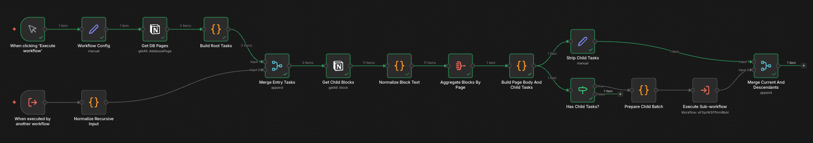

# Week 4 - jewoong

## 아웃풋 목표
- n8n 기반의 노션 DB 페이지 본문 내용 취합 (recursively) 파이프라인 구축

## 파이프라인 설계

### 전체 흐름



### 노드별 역할

| 노드 | 역할 |
|------|------|
| Workflow Config | databaseId, maxDepth, pageLimit 설정값 관리 |
| Get DB Pages | Notion DB에서 페이지 목록 조회 |
| Build Root Tasks | 페이지를 재귀 처리용 태스크 포맷으로 변환 (depth: 0) |
| Normalize Recursive Input | 서브워크플로우 입력의 childTasks 배열을 개별 아이템으로 평탄화 |
| Merge Entry Tasks | 루트 태스크와 재귀 자식 태스크를 하나의 흐름으로 합류 |
| Get Child Blocks | 각 페이지의 블록 전체 조회 |
| Normalize Block Text | 블록 타입별 텍스트 추출, childPageId 마킹 |
| Aggregate Blocks By Page | parentPageId 기준으로 블록 그룹핑 |
| Build Page Body And Child Tasks | bodyText 생성, 자식 페이지 childTasks 구성 |
| Strip Child Tasks | childTasks 제거 후 최종 페이지 결과 출력 |
| Has Child Tasks? | 자식 페이지 존재 여부 분기 |
| Prepare Child Batch | childTasks를 개별 아이템으로 평탄화 |
| Execute Sub-workflow | 자식 페이지 처리를 위해 워크플로우 자기 호출 |
| Merge Current And Descendants | 현재 페이지 결과 + 하위 페이지 결과 flat 배열로 병합 |

### 최종 출력 포맷 (페이지당 1 item)
```json
{
  "pageId": "...",
  "name": "페이지 제목",
  "url": "https://notion.so/...",
  "depth": 0,
  "lineage": "상위페이지 > 현재페이지",
  "bodyText": "파싱된 본문 전체 텍스트",
  "blockCount": 12,
  "childPageCount": 2
}
```

## 이번 주 진행 내용

1. 기존 워크플로우(`Notion Recursive Page Body + Claude`) 분석
    - 노션 중첩 페이지를 재귀적으로 파싱하기 위한 워크 플로우 설계 부분이 의도대로 동작하지 않는 문제
    - 단순히 n8n 툴에 대한 숙련도가 떨어지는 문제인지 확인하기 위해 n8n import가 가능한 json 파일을 calude cli 기준으로 재검토
    - `Prepare Child Batch`가 childTasks만 추출하고 나머지 컨텍스트 데이터 소실 확인

2. Claude API를 제외한 순수 Notion 페이지 파싱 파이프라인으로 목표 축소 후 재설계

3. 파이프라인 구현 및 반복 디버깅
    - Merge Entry Tasks 모드 문제 → `append` 모드로 수정
    - Loop Over Pages (Split In Batches) 도입 → done 포트 cross-branch 참조 불가 문제 발생
    - Aggregate Blocks By Page 패턴으로 재설계 → Notion 노드 단일 실행 문제 확인

4. n8n의 구조적 한계로 인해 현재 파이프라인으로는 목표 달성이 어렵다는 결론 도달

## 작업 중 막힌 것 / 해결한 것

**막힌 것**

- **Notion 노드 단일 실행 문제**: `Get Child Blocks` 노드는 여러 아이템이 입력으로 들어와도 첫 번째 아이템의 pageId에 대해서만 실행됨. n8n에서 외부 서비스 연동 노드는 기본적으로 `runOnceForAllItems`로 동작
  - 이를 해결하기 위해 split 노드를 통해 각 페이지마다 워크플로우가 실행되도록 설계를 변경
- **Split In Batches done 포트 cross-branch 참조 불가**: loop 포트와 done 포트는 서로 다른 실행 브랜치이므로, done 포트 이후 노드에서 loop 브랜치 내 노드의 실행 결과를 함께 참조할 수 없음
- **가변 깊이 재귀의 n8n 표현 한계**: 페이지마다 재귀 깊이가 다른 구조를 서브워크플로우 자기 호출로 구현하면 실행 오버헤드가 크고 결과 수집이 복잡해짐

**해결한 것**

- Merge Entry Tasks를 `append` 모드로 변경하여 메인 실행과 서브워크플로우 실행 양쪽 모두에서 정상 동작하도록 수정
- 순환 참조 방지 로직 (`ancestorIds` 집합으로 이미 방문한 pageId 체크) 설계 (BFS)

## 새로 알게 된 것

- **n8n에서는 중첩된 노션 페이지 파싱처럼 가변적인 깊이의 재귀 처리 방식을 표현하기 어렵다는 것. 차라리 코드로 구현하는 것이 더 쉽다.**
    - n8n은 실행 전에 노드 간 연결이 고정되는 DAG 구조로, 런타임에 동적으로 분기 깊이를 결정하는 재귀 로직과 설계 철학이 맞지 않음
    - n8n이 적합한 유스케이스는 "A 서비스에서 데이터 가져와 B 서비스로 보내기" 같은 선형 데이터 파이프라인
    - 재귀 파싱 자체는 단일 Code 노드 안에서 Notion API를 직접 호출하는 재귀 함수로 구현하고, n8n은 트리거와 이후 처리(LLM 호출, DB 저장 등)만 담당하는 구조가 현실적인 최선

- **n8n 외부 서비스 연동 노드(Notion, Slack, HTTP 등)는 기본적으로 `runOnceForAllItems`로 동작한다.** 아이템별 반복 실행(`runOnceForEachItem`)은 Code 노드에만 해당하며, 외부 연동 노드를 아이템별로 반복 실행하려면 Split In Batches가 필요하다.

- **Split In Batches의 done 포트는 원본 입력 데이터를 반환한다.** 루프 내에서 처리된 결과물을 수집하는 기능이 없으며, done 포트 이후 노드에서 loop 브랜치 내 노드의 결과를 cross-branch 참조하는 것은 불가능하다.

## 다음 주 계획
- 파이프라인 오케스트레이션 주체를 n8n에서 code(java)로 변경
- codex CLI 세션 내용을 기반으로 하루 업무 내용 및 배운점을 정리하는 파이프라인을 우선적으로 설계 진행 예정
