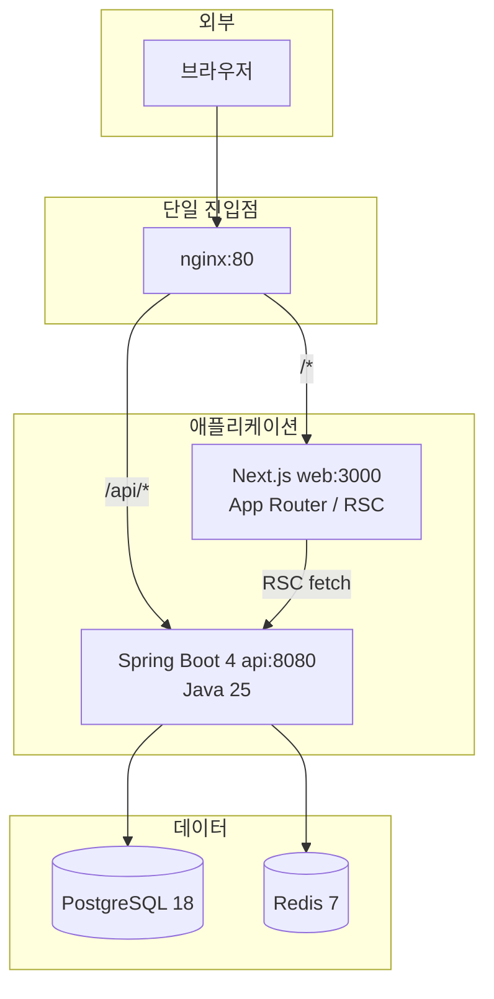
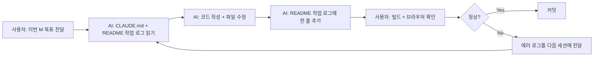
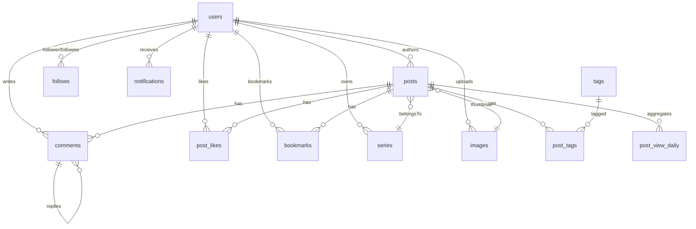

# Week 2 - seokbeom

## 이번 주 목표

> 이번에는 **AI 에이전트에게 풀스택 서비스 하나를 통째로 맡겨보는 실험**이었습니다.

- 개인 블로그(my-blog) 프로젝트를 **제가 직접 코딩하지 않고 Claude Code 가 대부분 작성**하도록 운영했습니다.
- "velog.io 스타일의 개인 블로그" 를 목표로, 소셜 로그인만 제외한 거의 모든 기능(MD 업로드/에디터/댓글/좋아요/북마크/팔로우/시리즈/알림/트렌딩/다크모드/통계)을 v1 스코프로 잡았습니다.
- 저는 **요구사항 정의, 설계 결정, 리뷰, 버그 재현, 빌드 담당**만 맡고, 실제 코드는 전부 AI 에게 위임했습니다.
- 핵심 질문:
  - AI 혼자서 어디까지 이어서 작업할 수 있는가
  - 세션이 끊겨도 "지금까지 뭘 했는지" 를 어떻게 기억시킬 것인가
  - 어떤 작업에서는 잘 하고 어떤 작업에서 막히는가

---

## 이번 실험이 풀고 싶었던 문제

개인 프로젝트를 AI 와 함께 하다 보면 매번 마주치는 문제들이 있습니다.

- **새 세션마다 컨텍스트가 리셋됩니다.** 지난 주에 뭘 설계했는지 다시 설명해야 합니다.
- **한 번에 너무 많은 일을 시키면 품질이 떨어집니다.** 그렇다고 너무 잘게 쪼개면 제가 코딩하는 게 빠릅니다.
- **설계 결정이 여러 곳에 흩어집니다.** 백엔드 레포, 프론트 레포, 도커 컴포즈 파일, 마이그레이션 SQL… 한 군데만 보면 전체 그림이 안 그려집니다.
- **AI 가 중간에 방향을 바꾸면 모릅니다.** "이거 원래 이렇게 하기로 한 거 맞나?" 를 매번 사람이 검증해야 합니다.

이번 주에는 이 네 가지를 **문서 구조와 작업 로그 규칙**으로 풀어보려 했습니다.

---

## 핵심 설계 원칙

### 1. 설계 문서는 한 곳, 코드는 두 레포

- 상위 설계는 `CLAUDE.md` 한 파일에 모읍니다.
- 이 파일은 어느 레포에도 커밋되지 않는 **작업 시작점(CWD)** 에 둡니다.
- 코드는 `my-blog-back-end` 와 `my-blog-front-end` 두 레포에 나누어 담습니다.
- AI 는 새 세션에서도 `CLAUDE.md → 두 레포의 README → 코드` 순으로 읽으면 전체 그림을 복구할 수 있습니다.

### 2. 작업 로그는 역순으로 쌓습니다

- 백엔드·인프라 작업은 `my-blog-back-end/README.md` 의 "작업 로그" 섹션에 매번 한 줄 이상 기록합니다.
- 프론트 작업도 동일하게 `my-blog-front-end/README.md` 에 기록합니다.
- **최신이 맨 위**. 새 세션에서는 맨 위 몇 줄만 읽어도 현재 상태를 파악할 수 있어야 합니다.
- 포맷: `- YYYY-MM-DD: (요약) — 추가 상세/파일 경로`

### 3. 마일스톤 단위로 쪼갭니다

- M1(스캐폴드) → M2(인증) → M3(Post/Tag/Image) → … → M14(도커 컴포즈 풀스택) 으로 번호를 매겼습니다.
- 한 세션에서 하나의 M 을 끝내는 것을 목표로 했습니다.
- M 이 끝나면 작업 로그에 **"M# 구현 — (핵심 변경) (왜)"** 형태로 남깁니다.

---

## 시스템 구조

이번 주 만든 my-blog 의 전체 구조입니다.

- **외부 진입점은 Nginx 하나**. 브라우저 입장에서 모든 요청이 동일 오리진이라 CORS 이슈가 없습니다.
- 파일 저장소가 **없습니다**. MD 원본은 `posts.content_md TEXT`, 이미지는 `images.data BYTEA` 로 DB 에 직접 박습니다.
- MD 렌더는 **프론트 런타임** (`react-markdown` + `rehype-*`). 서버는 원본만 보관합니다.

---

## AI 와 일하는 방법 — 실제 흐름

- 새 세션을 열면 AI 는 **아무 말 없이도** `CLAUDE.md` 와 두 README 를 읽고 "지금 M13 까지 끝났구나" 를 파악합니다.
- 에러가 나면 저는 에러 로그만 복붙합니다. 원인 추적은 AI 가 합니다.
- 작업 로그는 **AI 자신을 위한 메모**이기도 합니다. 다음 세션의 AI 가 지금 세션의 AI 가 남긴 한 줄을 보고 맥락을 복구합니다.

---

## 완료된 마일스톤 (M1 ~ M14)

| # | 범위 | 핵심 결과 |
|---|---|---|
| M1 | 백엔드 스캐폴드 | Spring Boot 4.0.5 + Java 25, Flyway V1~V4, `docker compose up -d db redis` 로 인프라만 먼저 기동 |
| M2 | 인증 | JWT(15m) + Redis refresh(14d) 로테이션, STATELESS, 공개 경로 화이트리스트 |
| M3 | Post / Tag / Image | MD 프론트매터 파싱, slug 생성, 이미지 BYTEA 서빙(immutable 캐시), 원본 MD 다운로드 스트림 |
| M4 | 댓글 / 좋아요 / 북마크 / 알림 | 이벤트 기반 알림(`@TransactionalEventListener` AFTER_COMMIT), 비정규화 카운터 원자 증감 |
| M5 | 팔로우 + 유저 프로필 | `/@nickname` API, 소셜 링크 3종, viewer 기준 `isFollowing` |
| M6 | 시리즈 | 글 순서 관리(`[{postId, order}]` 일괄 재배치), (author, slug) 복합 UNIQUE |
| M7 | 트렌딩 + 조회수 버퍼링 + 레이트리밋 | Redis `post:view:*` → 60s 스케줄러 → `posts.view_count` 누적 + `post_view_daily` UPSERT, 주/월 랭킹 1h 캐시 |
| M7.5 | 통계 대시보드 | `/api/users/me/stats` — 최근 7일 일별 조회수 항상 7포인트 고정 반환 |
| M8 | 프론트 스캐폴드 | Next.js 15 + React 19 + Tailwind 3 + next-themes + zustand + react-query |
| M9 | 로그인/회원가입 + 부트스트랩 | 앱 시작 시 `refresh → me` 자동 호출, 401 자동 재발급 인터셉터 |
| M10 | MD 에디터 + 업로드 + 글 수정 | `@uiw/react-md-editor` 드래그앤드롭, 30초 localStorage 자동 저장, DRAFT 편집 |
| M11 | 댓글/좋아요/북마크 UI | 낙관적 업데이트 + 롤백, viewer-state 전용 엔드포인트로 뷰카운트 중복 bump 방지 |
| M12 | 프로필 / 팔로우 / 시리즈 / 북마크 UI | App Router `@` prefix 충돌 회피를 위한 `rewrites` 트릭 |
| M13 | 알림 + 설정 + 통계 UI | 헤더 알림 벨 60s 폴링(재귀 setTimeout), 순수 CSS 바 차트(차트 라이브러리 의존성 X) |
| M14 | 도커 컴포즈 풀스택 | `docker compose up` 한 방, api 내부화 + TCP 헬스체크(`/dev/tcp/localhost/8080`) |

---

## 데이터 모델 한눈에

10 개 테이블, 대부분 소셜 기능용. `content_html` 컬럼은 없습니다 (프론트 런타임 렌더 정책 일관).

---

## AI 가 잘한 것 vs 못한 것

### 잘한 것

- **설계 → 코드 변환**. 설계 문서의 스키마/API/Redis 키 전략이 그대로 JPQL·엔티티·컨트롤러로 튀어나옵니다.
- **버그 원인 역추적**. 에러 로그 한 줄만 줘도 JDBC 드라이버 내부 동작까지 파고듭니다.
- **문서 동기화**. 코드 바꾸고 나서 README 작업 로그를 자동으로 한 줄 추가합니다. 가끔 너무 장황하지만 정보는 정확합니다.
- **의존성 버전 정정**. SB 4.0.0 이 없는 버전인 걸 Maven Central HEAD 로 확인하고 4.0.5 로 고쳐옵니다.

### 못한 것

- **빌드가 안 되는 코드**. 컴파일 전에는 오타·누락을 잡지 못합니다. 제가 매번 빌드해서 넘겨야 합니다.
- **프레임워크 최신 변경사항**. Spring Boot 4 의 Flyway 모듈 분리처럼 최근에 바뀐 건 한두 번은 틀립니다.
- **UI 디테일**. 색·간격·반응형은 제가 직접 조정하는 게 빠릅니다.
- **전체 플로우 감각**. M 하나가 끝나면 그 범위 안에서는 완벽한데, M 끼리 엮이는 지점(`PostCard` 가 nested `<Link>` 로 깨지는 것 같은)은 놓칩니다.

---

## 작업 로그 규칙이 실제로 작동한 방식

세션을 넘기면서 가장 효과가 좋았던 건 **README 작업 로그 한 줄에 "왜 그렇게 했는지"를 같이 적는 규칙** 이었습니다.

단순 "M4 구현" 이 아니라:

> **2026-04-19**: **M4 Comment/Like/Bookmark/Notification 구현** — PostRepository 에 `incrementLikeCount`/`decrementLikeCount` @Modifying 쿠리 추가(감소는 `CASE WHEN > 0` 가드) ...

이렇게 **의도와 제약** 이 같이 적혀 있으니, 다음 세션 AI 가 "아 이 카운터는 음수 가드가 있었지" 를 그대로 이어서 갑니다. 설계가 일관되게 유지되는 것의 대부분은 이 한 줄들 덕분입니다.

---

## 구현 시 예상되었고 실제로 터진 리스크

| 문제 | 예상 여부 | 실제 대응 |
|---|---|---|
| 세션 사이 컨텍스트 유실 | 예상됨 | CLAUDE.md + README 작업 로그로 복구 — 거의 문제 없음 |
| AI 가 설계에서 벗어남 | 예상됨 | 마일스톤 번호 + 로그 한 줄에 "Why" 기록으로 억제 |
| 빌드/실행 에러 | 예상됨 | 사람이 전담 — AI 는 코드만, 빌드는 나만 |
| 최신 프레임워크 오용 (SB 4 Flyway) | 예상 못함 | 에러 기반 반복 수정 — 2~3 라운드 소요 |

---

## 한 줄 요약

이번 주는 **"AI 에게 코딩을 시키는 것"이 아니라 "AI 가 자기 작업을 스스로 이어갈 수 있는 환경을 만드는 것"** 이 목표였고,
`CLAUDE.md + 양쪽 README 의 작업 로그` 라는 단순한 구조만으로 M1~M14 풀스택 블로그 한 채가 세션 간 일관성을 유지한 채 조립됐습니다.
