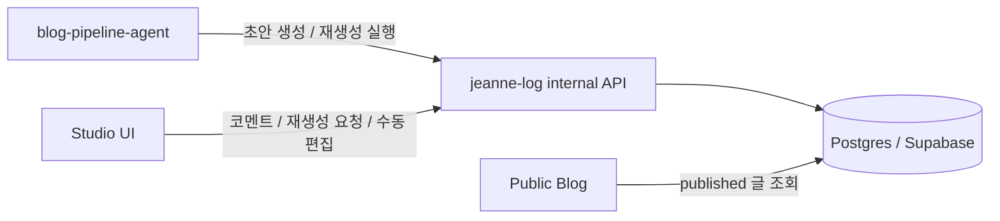

# Week 5 - jinhwa

## 작업 진행과 개선 필요

Claude/Codex 세션 기록을 긁어와 정리하고, 초안까지 생성하는 흐름까지 완료.
그러나 마주한 문제는

- 세션 기록만으로는 “무엇을 했는가”는 어느 정도 드러나는 상태
- 반면
  - 왜 그 작업을 하게 되었는지
  - 어떤 고민 끝에 그 방향을 선택했는지
  - 어떤 맥락에서 그 일이 중요했는지
    같은 정보는 잘 남지 않는 상태
- 옵시디언으로 그 맥락을 보완하고 있었지만
  - 업무 기록을 매일 남긴 것은 아니어서
  - 중간중간 맥락이 비는 구간이 생기는 상태
- 그 결과 블로그로 엮을 때
  - 기술적인 작업 로그는 많이 남는 반면
  - 문제의식, 고민, 선택의 이유는 약한 상태
  - 결국 기술적인 사실만 나열된 영양가 낮은 글이 되기 쉬운 상태

즉 이번 주의 문제는 단순히 “자동으로 글을 잘 써주느냐”의 문제가 아니었음.  
**맥락이 빠진 기록으로는 좋은 기술 블로그를 만들기 어렵다**는 점이 더 큰 문제였음.

이 문제를 풀기 위해 필요하다고 본 방향은 두 가지였음.

- 글 생성 파이프라인 자체를 더 다루기 쉬운 구조로 바꾸는 일
- 초안 생성 이후 사람이 맥락을 보강하고, 피드백을 누적하고, 다시 재생성할 수 있는 리뷰 루프를 만드는 일

이번 주 작업은 그중 두 번째 축, 즉 **초안 이후의 리뷰/수정/재생성 흐름을 정리하는 작업**에 가까운 상태였음.

## 아웃풋 목표

> 이번 주 구현 목표

- `jeanne-log`의 DB 기반 콘텐츠 저장소 전환
- 초안/리뷰/재생성 흐름을 위한 관리자 스튜디오 구축
- `blog-pipeline-agent`의 PR 기반 흐름 제거 및 internal API 연결
- regenerate loop end-to-end 1회 검증

## 전체 구조

- `jeanne-log`
  - DB를 source of truth로 사용하는 역할
  - 공개 글 렌더링 역할
  - 스튜디오 UI / 관리자 인증 역할
  - comment CRUD / regenerate 요청 생성 역할

- `blog-pipeline-agent`
  - 초안 생성 역할
  - regenerate job 소비 역할
  - LLM 호출 역할
  - 결과를 internal API로 다시 제출하는 역할

즉, **웹앱은 상태 관리**, **파이프라인은 생성 실행** 담당이라는 구조였음.

## 이번 주 진행 내용

### 1. DB 기반 블로그 구조 도입

`jeanne-log`에 Postgres + Drizzle 기반 추가 작업 진행.

- article / article_version / review_comment / regeneration_job 중심 스키마 설계
- 공개 글 조회 경로를 파일 우선이 아니라 **DB 우선, 파일 fallback** 구조로 변경
- 레거시 `contents/article/*.mdx`를 DB로 옮기는 import 스크립트 작성

실제 Supabase에 스키마를 반영하고, 레거시 글 11개 import까지 수행한 상태였음.

### 2. 스튜디오 UI 구축

`/studio` 아래에 초안 관리 화면 구축.

- `/studio/login`
  - env 비밀번호 기반 관리자 로그인
- `/studio/drafts`
  - draft 목록
  - 상태 / 버전 / open comment 개수 확인
- `/studio/drafts/[id]`
  - 본문 직접 수정
  - 코멘트 작성 / 수정 / 삭제 / resolve
  - regenerate 요청 버튼
  - 버전 목록 확인

핵심은 “순수 에디터 + 리뷰 도구”를 한 흐름에 묶는 방향이었음.

- 본문 직접 수정 가능 상태
- line range 기준 코멘트 관리 가능 상태
- 코멘트를 바탕으로 regenerate 요청 가능한 상태

까지를 한 화면 흐름 안에서 다루는 구조였음.

### 3. 파이프라인과 internal API 연결

기존 `weekly_publish.py`, `publish_project.py`는 파일 생성 + PR 생성까지 수행하던 구조였음.  
이번 주에는 이 출력을 **internal API draft submit** 흐름으로 변경한 상태였음.

추가/변경한 것:

- `POST /api/internal/drafts`
- `GET /api/internal/jobs/next`
- `POST /api/internal/jobs/:id/complete`
- `POST /api/internal/jobs/:id/fail`
- `blog-pipeline-agent/scripts/internal_api.py`
- `blog-pipeline-agent/scripts/regenerate_drafts.py`

현재 regenerate 버튼 이후 흐름은 아래와 같음.

1. `jeanne-log`가 DB에 job을 `queued`로 생성
2. `blog-pipeline-agent` 워커가 job claim
3. Claude로 본문 재생성
4. 결과를 새 article version으로 저장

### 4. regenerate loop 검증

이번 주 가장 중요한 검증 포인트였음.

실제 검증 흐름:

- 스튜디오에서 regenerate 요청 생성
- DB에서 `queued` 확인
- 로컬 워커 수동 실행
- job이 `running`으로 바뀌는 것 확인
- 최종적으로 `completed` + 새 version 생성 확인

## 문제 상황 / 해결

### 1. internal API 접근 경로 문제

파이프라인과 웹앱을 internal API로 연결한 뒤, 실제 운영 경로에서 막히는 문제 발생.

- `jeannelee.me` 앞단 Cloudflare가 `/api/internal/*` 요청을 차단하는 상태
- 앱 코드나 토큰 문제라기보다 **도메인 앞단 보호 계층 문제**였던 상태
- preview / production 경로를 각각 검증해 보면서, 어느 층에서 막히는지 확인 필요 상태

해결 내용:

- 파이프라인 호출 경로를 PR preview / production 기준으로 각각 분리 검증
- internal API 자체는 정상 동작함을 확인
- 실제 남은 이슈는 앱 내부가 아니라 **배포 도메인과 보호 계층 설정** 쪽이라는 점 확인

즉, “internal API가 안 붙는다”가 아니라 **어떤 도메인과 어떤 보호 계층을 통과하느냐의 문제**였음.

## 단순화한 기능

- 인증
  - OAuth 대신 env 비밀번호 방식 선택
  - 1인 운영 기준에서 가장 빠른 방식
- regenerate 실행
  - 상시 daemon 대신 cron + worker script 구조 선택
  - queue 구조는 유지하되 운영 방식은 단순화한 상태
- 글 포맷
  - WYSIWYG 에디터 대신 markdown source 중심 선택
  - 현재 요구사항은 인라인 리뷰와 재생성이 핵심이기 때문

즉, “나중에 확장 가능한 구조”는 유지하되, **현재 운영 복잡도는 낮추는 방향**으로 가져감

## 다음 주 계획

### 1. regenerate worker 로그 보강

현재는 job claim 이후 Claude 호출 중간 로그가 거의 없는 상태.

- `regenerate_drafts.py`에 단계별 로그 추가 예정
- `logs/regenerate.log` 기준 진행 상태 추적 가능하게 할 예정

### 2. publish flow 마무리

이번 주는 초안/리뷰/재생성까지를 우선 범위로 둔 상태였음.  
다음 단계는 아래와 같음.

- UI 정비
- publish 버튼
- publishedVersion 갱신
- archive 처리

즉 “초안 작성 → 리뷰 → 재생성 → 발행” 루프를 닫는 작업 예정.
