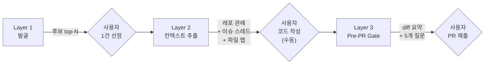

# Week 5 - kyungseop

## 이번 주 방향 전환

원래는 week2에서 잡아둔 블로그 자동화 파이프라인(시드 → 초안 → 리라이트 → 발행)을 이어 만드는 흐름이었는데, 최근 오픈소스 기여를 이것저것 하면서 그쪽 루틴이 훨씬 더 반복적이라는 걸 체감했다.

- 이슈 찾고 (수동 검색)
- 해당 레포 관례/테스트 스타일 파악하고
- 코드 쓰고 PR 체크리스트 수동으로 통과하고

세 단계가 매번 거의 똑같이 반복되는 구조. 요즘 AI로 작성된 게시글을 자주 봐서인지 AI를 활용한 작문에 점점 흥미를 잃어가기도 하고.. 블로그 자동화보다 여기가 자동화로 얻는 이득이 더 크다고 판단해서, 이번 주는 OSS 기여 AI 자동화 파이프라인을 설계했다.

그리고 이 주제로 파이프라인을 설계하며 한 가지 특이한 부분이 있었다. 최근 curl, ffmpeg, CPython 같은 대형 프로젝트에서 AI가 생성한 저품질 PR이 메인테이너를 폭격(?)해서 'AI 생성 PR 즉시 밴' 기조가 퍼지는 중이다. 나 역시 OSS 기여 시에는 AI 흔적을 남기지 않고, 대칭성이나 우연한 동작, 테스트 범위 같은 검증은 반드시 직접 해왔고. 그래서 이번 파이프라인은 'AI를 쓰긴 쓰는데, 결과물에는 AI 티가 전혀 안 나야 하고, 검증도 사람이 한다'는 조건 위에서 설계해야 했다. 막연히 코드도 안 읽고 ~해줘 식으로 오픈소스 기여를 하는 것처럼 의미없는 일이 없기도 하지만. 어쨌든 뭘 자동화하고, 뭘 자동화하면 안 되는가가 이 파이프라인 설계의 핵심 논점이었다.

## 아웃풋 목표

> 최종 결과물

- OSS 이슈 발굴부터 PR 직전 체크리스트까지를 돕는 3-레이어 하이브리드 도구
- **자동화하는 것**: 정보 수집, 스코어링, 레포 관례 추출, diff 기반 질문 프롬프트
- **자동화 안 하는 것**: 코드 작성, PR 본문, 이슈 코멘트 게시, 자동 커밋/푸시
- 산출물 저장 위치: `for-claude/personal/open-source/docs/` 안에서만 관리 (외부 싱크 없음)

## 파이프라인 설계

- **수집 소스**: GitHub Search API + GraphQL, 레포 shallow clone, 로컬 `git diff`
- **사용 툴/프레임워크**: Claude Code, Codex, GitHub PAT
- **발행 채널**: 없음 (산출물은 모두 로컬 문서)

### Layer 1 — 발굴

수동 트리거. GitHub Search + 스코어링으로 top-N 후보 뽑아서 `latest.md` 한 장에 담는다.

**스코어링 축 (초안)**

| 축 | 데이터 |
|----|--------|
| 스택 매칭도 | 레포 언어, topics, 파일 확장자 |
| 난이도 추정 | 이슈 본문 길이, repro 여부, 댓글 수 |
| 메인테이너 활성도 | 최근 30일 머지 수, 마지막 커밋 |
| 경쟁 활동성 | 오픈 PR + 할당자의 30일 활동 |
| 레포 상태 | `isArchived`, monorepo 이관 여부 |

중복 PR 감지가 이 레이어에서 어려운 지점. 얼마 전에 nestjs/typeorm에 PR을 올렸다가 기존 PR이 이미 있어서 close된 경험이 있는데, 그때 기존 PR은 이슈에 링크조차 되어 있지 않은 상태였다. `linked pull requests`만 보면 못 잡더라. 그래서 세 개의 경로를 OR로 묶었다. (linked PRs + `in:title/in:body` 전문 검색 + 이슈 본문 내 PR URL 정규식 스캔)

### Layer 2 — 컨텍스트

이슈 1건 URL을 넣으면 해당 레포의 CONTRIBUTING, 테스트 관례, 최근 머지 PR 5건 패턴, 이슈 스레드 전문, 파일 맵 힌트를 `{repo}-{issue}-context.md`로 뽑아준다.

레포마다 문서 포맷이 제각각이라 정적 파싱만으로는 안 되는 항목이 있다. 그래서 기본은 정적 파싱, 실패 시 LLM 요약으로 폴백하는 2-경로로 나눴다. 이슈 1건당 LLM 호출 3회 / 토큰 20k를 상한으로 두고, 넘으면 사용자 확인하도록 처리.

### Layer 3 — Pre-PR Gate

로컬 `git diff`를 넣으면 체크리스트 통과/실패가 아니라 질문 5개를 띄운다. 원래는 5개 항목 자동 스캔해서 PASS/FAIL 결과가 나오게끔 설계했는데, 검토하다 보니 녹색 체크를 승인으로 오해할 여지가 너무 컸다. 특히 예전에 nestjs/swagger 레포에서 path 변환 `from`/`to` 좌표계 불일치로 regression을 낸 사례가 있었는데, 이건 grep이나 AST 스캔으로 원천적으로 못 잡는 문제였다.

그래서 출력을 질문으로 뒤집어봤다. 예를 들어:

- 이 변경이 쌍(encode/decode, from/to) 연산을 건드리는가? 반대쪽도 고쳤는가?
- 수정한 함수의 기존 동작이 "의도"인지 "우연한 상쇄"인지 확인했는가?
- no-op 시나리오(옵션 미지정 시 기존 동작 유지) 테스트가 있는가?

옆에는 자동 수집한 근거 데이터만 붙여둔다. 판단은 사람이.

## 이번 주 진행 내용

- OSS 쪽으로 방향 전환하면서 최근 기여(firebase-functions, semver-checks, holidays-kr 등) 패턴을 역으로 뽑음
- 3-레이어 아키텍처 초안 작성 (`oss-automation-pipeline.md` v0.1)
- 자체 리뷰 한 번 돌림. 이때 잡힌 구멍 8개를 v0.2에서 전부 반영
  - KPI 3개 명시 (실착수율, 머지 리드 타임, FP율)
  - 중복 PR 감지 3경로 OR
  - '경쟁 PR 유무' → '경쟁 활동성'으로 축 확장
  - Layer 2 추출을 정적 파싱 vs LLM 2-경로로 분리
  - Layer 3 출력을 체크 리포트에서 질문 프롬프트로 뒤집음
  - config.yaml 단일 소스 + MEMORY는 포인터만
  - **Phase A.5 (Backtesting) 신설** — Phase B 착수 게이트
  - 스냅샷 누적 정책 (`latest.md` + `archive/YYYY-Www.md`)

## 자동화하지 않기로 한 것

내가 실제로 쓸 수 있는 도구를 만드는 게 목표라 이 부분을 먼저 못 박았다.

| 영역 | 제외 사유 |
|------|----------|
| 코드(패치) 생성 | OSS 커밋에 Claude 흔적 금지 원칙 |
| PR 본문 작성 | 메인테이너 신뢰 훼손 리스크 |
| 이슈 코멘트 자동 게시 | 스팸 리스크, 수락 가능성 떨어짐 |
| 자동 커밋/푸시 | 사용자가 직접 수행 |
| cron 기반 백그라운드 실행 | 의도치 않은 PR 양산 방지 |

블로그 파이프라인에서도 같은 교훈을 얻었다. AI한테 알아서 쓰게 맡기면 1차 결과물을 사람이 전수 검사해야 하고, 그러면 자동화 의미가 사라진다. 대신 AI의 역할을 구조화와 질문 제공으로 좁히고, 판단과 작성은 사람이 하도록 둔다.

## 주요 설계 결정

- **주 1회 on-demand, cron 없음**: 의도치 않은 PR 양산 방지. 자동 실행을 한 번이라도 허용하면 경계가 무너지기 때문.
- **Phase B 착수 게이트(Backtesting) 신설**: 스코어링 가중치 0.25/0.20/... 숫자에 근거가 없었다. 이걸 그대로 구현하면 숫자만 그럴싸한 과적합 위험이 컸다. 그래서 과거 기여 10건을 진입 결정 시점 상태로 복원해서 라벨링한 뒤, 알고리즘이 70% 재현율과 중복 감지 둘 다 통과해야 Phase B 착수.
- **config.yaml 단일 소스**: Claude Code의 MEMORY 시스템에 차단 키워드를 쌓아왔는데, 실제 Layer 1 필터 구현과 MEMORY가 조용히 엇갈릴 위험이 있다. config.yaml을 유일 소스로 두고 MEMORY는 어떤 키에 반영됐는지 포인터만 남기는 쪽으로 정리.
- **Layer 3 출력을 질문으로**: 체크리스트가 아니라 질문으로 수정. 녹색 체크에 내가 속지 않도록!

## 구현 중 막힌 것 / 해결한 것

| 문제 | 해결 여부 | 메모 |
|------|-----------|------|
| 중복 PR 감지를 `linked pull requests`만 보면 놓침 (nestjs/typeorm #2567 경험) | ✅ | 3경로 OR로 확장. `in:title/in:body` 전문 검색 + 본문 URL 스캔 추가 |
| 스코어링 가중치에 근거 없음 | ✅ | Phase A.5 Backtesting 게이트 신설. 재현율 70% 통과 전 Phase B 미착수 |
| Layer 3가 "체크 통과"로 오인될 위험 | ✅ | 출력 자체를 질문 프롬프트로 재설계, ❌/✅ 아이콘 금지 |
| 스냅샷이 주 1회 × 1년 = 52개 쌓이는 문제 | ✅ | `latest.md` 덮어쓰기 + 2주 지난 것만 archive로 이동 (최대 6개월) |
| 자체 npm 패키지(holidays-kr 등)도 discovery 대상인가 모호 | ✅ | 명시적 제외. 자체 패키지는 별도 `in-progress.md` 흐름 유지 |

## 인사이트 / 배운 것

- **자동화하지 않을 것을 먼저 정하면 설계가 빨라진다.** 뭘 할까보다 뭘 안 할까가 먼저다. 이번 설계에서 제외 목록을 표로 박아두니까 이후 레이어 설계에서 이게 가능할지 같은 고민이 거의 안 들어갔다. 경계가 명확하면 파이프라인 범위가 자동으로 좁아진다. 블로그 파이프라인 때 뭘 AI한테 맡기지 않을지를 마지막에 정했더니 중간에 계속 흔들렸는데, 이번엔 그 순서를 뒤집으니 설계가 안정됐다.
- **저품질 AI PR 밴 기조가 역설적으로 설계 제약을 명확하게 해줬다.** 최근 대형 OSS에서 AI 생성 PR이 배격당하는 분위기가 없었다면 메인테이너한테 PR 본문도 자동 생성해서 제출하면 빠르고 좋지 않나 라고 쉽게 넘어갔을 거다. 외부에서 규범이 형성되면 내 설계 경계도 자연스럽게 잡히는 구간이 있다.
- **자체 리뷰 한 번이 구현 한 주를 아낀다.** v0.1 초안 쓰고 바로 구현으로 넘어갔으면 스코어링 가중치를 그대로 뽑아 썼을 거고, Backtesting 없이 결과를 보고 뭔가 이상한데 하면서 몇 주를 날렸을 거다. 설계 문서를 본인이 한 번 뒤집어보는 시간이 구현보다 싸다. 특히 숫자가 들어간 부분(가중치나 임계치)은 반드시 한 번 의심해야 한다.
- **반례 케이스를 설계 단계에서 하드코딩하면 안전장치가 생긴다.** Backtesting 세트에 중복으로 close된 내 실패 사례를 라벨로 박아뒀다. 이 한 건이 Phase B 착수 게이트가 된다. 실패 경험을 문서에 묻어두는 게 아니라 자동화의 검증 기준으로 바꾸면, 같은 실패가 반복될 확률이 구조적으로 줄어든다.

## 다음 주 계획

- Phase A.5 — Backtesting 세트 구축
  - `oss-backtesting-set.md` 문서 신규 작성
  - 과거 기여 10건을 **진입 결정 시점 상태**로 라벨링 (firebase-functions #1874, firebase-admin-node #3075, firebase-tools #9929, class-transformer #740, semver-checks 관련, nestjs/typeorm #2567 등)
  - 스코어링 알고리즘 페이퍼 테스트 — 양성 9건 중 top-10 재현율 70% + 중복 감지 발화 확인
  - 통과 시 Phase B 착수 (Layer 1 CLI 프로토타입)
