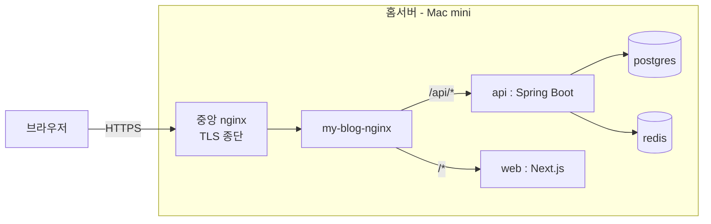
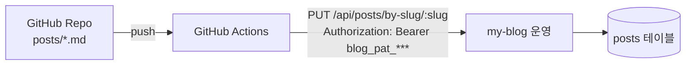

# Week 5 - seokbeom

## 이번 주 한 일

> 이번 기회에 **맥미니 한 대를 사서 홈서버를 세팅**했고, 4주차에 만든 my-blog 를 그 위에 올린 뒤 **GitHub Actions 에서 MD 파일을 push 만 하면 글이 자동 발행되는 흐름** 까지 직접 테스트해봤습니다.

- 맥미니 기반 홈서버 환경 구축
- my-blog 풀스택을 홈서버 위에 운영 배포
- GitHub Actions → 블로그 자동 발행 진입로 추가
- 워크플로우를 돌려 실제 발행까지 확인 완료

---

## 왜 굳이 내 블로그를 만들고 거기에 자동 발행까지 붙였는가

- 외부 블로그(velog 등) 는 **아카이빙 용도** 로는 충분하지만, 자동화하기는 불편해서
- **내 마음대로 1차 정리할 공간** 을 따로 두고, 그중에서 진짜 포스팅용으로 다듬을 글은 **별도로** 정리하는 흐름이 더 맞다고 판단했습니다.
- 이번 기회에 그 1차 정리 공간을 **내 홈서버 위에 직접** 올려두기로 했습니다.

---

## 운영 배포 구조 (간략)

---

## 외부 자동화 진입로 (GitHub Actions → 블로그)

자동 발행을 위해 백엔드에 **개인 API 토큰(PAT)** 과 **slug 기반 upsert 엔드포인트** 를 그냥 추가했습니다. 큰 고민 없이 진행했고, 동작도 바로 확인했습니다. 블로그 자동화를 좀 더 간편하게 하려고 만든 보조 기능 정도로 보면 됩니다.

---

## 1~3주차 파이프라인과의 연결

1~3주차에 만든 흐름(stack 수집 → daily 분류 → weekly 요약) 의 끝에는 **md 파일** 이 떨어집니다. 그 md 를 받아서 블로그에 올리는 진입로가 이번 주에 만든 **API 로 md 올리는 그 부분** 입니다.
---

## 다음 계획

앞으로는 **차차 이 블로그와 시스템을 제가 쓰기 편한 쪽으로** 조금씩 손볼 예정입니다.

---

## 한 줄 요약

이번 주는 평소에 해보고 싶었던 **홈서버 구축에 초점이 갔던 한 주** 였고, 그 김에 my-blog 를 올리고 외부 자동화 진입로까지 붙여본 김에 다 같이 정리됐습니다. 이런 세팅을 차분히 할 기회가 되어서 좋았습니다!
