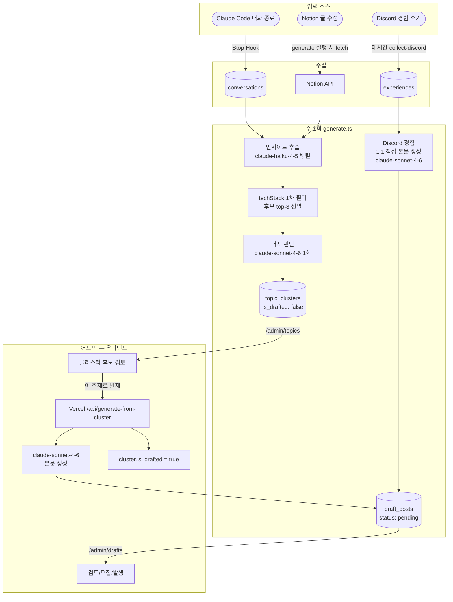

# Week 6 - hongbi

## 아웃풋

> 매주 자동으로 글이 양산되어 같은 주제가 파편화되던 문제를 해결 — **주제 누적 + 어드민 온디맨드 발제** 구조로 전환

- 본문 자동 생성 제거 → `topic_clusters`에 인사이트만 누적
- 어드민이 "이 주제로 발제" 누르는 시점에 본문 생성 (Sonnet 비용 통제)
- techStack 1차 필터로 머지 판단 시 Sonnet 토큰 폭증 방지
- `last_updated_at` 메타로 stale 클러스터 식별 가능
- Vercel Serverless Function으로 본문 생성 로직 단일화 (프롬프트 drift 방지)
- blog-site에 `/admin/topics` 페이지 추가 — 누적된 주제 후보 검토/발제 UI
- **Discord 경험 후기는 별도 파이프라인 유지** (1:1 직접 draft 생성, 변경 없음)

---

## 배경 — 왜 자동 발제를 끊어야 했나

### 5주차까지 구조

```
매주 월요일 09:00 KST
  → generate.ts
  → 기술 대화 / Notion / Discord 후기 모두 그 시점에 한 번에 처리
  → 인사이트 추출 → 클러스터링 → 본문 생성 → draft_posts(status=pending)
```

### 발견한 문제

같은 주제로 1주 이상 작업하는 경우가 많음. 예: "Next.js App Router 마이그레이션"을 3주에 걸쳐 작업.

이 구조에서는 **3주에 같은 주제 글이 3개 따로 만들어짐**. 매주 generate가 돌면서 직전 주의 클러스터는 메모리에서 사라지고 새로 처음부터 클러스터링하기 때문.

> "맨날 월요일마다 글이 생성되어 버리니까 하나의 주제로 일주일 이상 개발을 할 때 글이 여러개 나와버려서, 그냥 해당 주제에 대해 글을 쓰고 싶을 때 주제를 선택해서 작성하고 싶은 거야."

원하는 동작:

- 같은 주제 데이터가 시간이 지나면서 같은 클러스터에 **누적**
- 정말 글로 쓰고 싶어졌을 때 어드민에서 **선택**해서 발제

---

## 구현 1 — 새 테이블 `topic_clusters`

```sql
CREATE TABLE topic_clusters (
  id BIGSERIAL PRIMARY KEY,
  theme TEXT NOT NULL,
  angle TEXT,
  quality_score INTEGER NOT NULL DEFAULT 3,
  insights JSONB NOT NULL DEFAULT '[]'::jsonb,        -- 누적된 인사이트
  source_projects TEXT[] DEFAULT '{}',
  tech_stack TEXT[] DEFAULT '{}',                     -- 1차 매칭용
  is_drafted BOOLEAN NOT NULL DEFAULT FALSE,          -- 발제 후 true
  drafted_post_id BIGINT,                             -- 생성된 draft 참조
  last_updated_at TIMESTAMPTZ NOT NULL DEFAULT NOW(),
  created_at TIMESTAMPTZ NOT NULL DEFAULT NOW()
);

CREATE INDEX topic_clusters_drafted_idx
  ON topic_clusters (is_drafted, last_updated_at DESC);
CREATE INDEX topic_clusters_tech_stack_idx
  ON topic_clusters USING GIN (tech_stack);  -- 배열 교집합 검색용
```

핵심 컬럼:

- `insights` JSONB — 매주 새로 들어온 인사이트가 여기 추가됨
- `tech_stack` TEXT[] — Sonnet 머지 콜 직전에 후보를 좁히는 1차 필터 키
- `is_drafted` — 어드민이 발제하면 true로 바뀌고, `/admin/topics`에서 숨김
- `last_updated_at` — 새 인사이트가 합쳐질 때마다 갱신, stale 클러스터 식별용

---

## 구현 2 — 누적(incremental) 클러스터링

### 핵심 함수 흐름

```
새 인사이트들 (Haiku 추출)
  ↓
prefilterPendingClusters
  → tech_stack 교집합 큰 후보 top-8 선별 (코드만, LLM 없음)
  ↓
mergeInsightsIntoClusters
  → Sonnet 1회: "각 인사이트를 기존 클러스터(E1~E8)에 합칠지, 새 클러스터로 묶을지"
  ↓
applyMergeToDb
  → 기존 cluster.insights에 append + last_updated_at 갱신
  → 새 클러스터는 INSERT
```

### 1차 필터 — Sonnet 토큰 폭증 방지

매주 pending 클러스터가 누적되면서 50~100개로 늘어나면, Sonnet에 전체를 보여주는 비용이 곱하기로 늘어남. tech_stack 교집합 기준으로 후보를 8개로 제한.

```typescript
export function prefilterPendingClusters(
  newInsights: Insight[],
  pending: PendingClusterRow[],
  topK = 8,
): PendingClusterRow[] {
  if (pending.length <= topK) return pending;

  const newTechs = new Set(
    newInsights.flatMap((i) => i.techStack.map((t) => t.toLowerCase())),
  );

  const scored = pending.map((c) => {
    const techs = (c.tech_stack ?? []).map((t) => t.toLowerCase());
    let overlap = 0;
    for (const t of techs) if (newTechs.has(t)) overlap++;
    return { c, overlap };
  });

  scored.sort((a, b) => {
    if (b.overlap !== a.overlap) return b.overlap - a.overlap;
    return (b.c.last_updated_at ?? "").localeCompare(a.c.last_updated_at ?? "");
  });

  return scored.slice(0, topK).map((s) => s.c);
}
```

동률일 땐 더 최근에 업데이트된 것 우선 — 활성 주제에 합쳐지도록.

### 머지 판단 — Sonnet 1회

Tool Use 강제로 routing 결정과 새 클러스터 메타데이터를 한 번에 받음.

```typescript
tool_choice: { type: "tool", name: "route_insights" }

input_schema: {
  decisions: [
    { new_insight_index, target_existing_cluster_id?, target_new_cluster_key? }
  ],
  new_clusters: [
    { key, theme, angle, quality_score, tech_stack }
  ]
}
```

각 인사이트마다:

- **기존 합치기** → `target_existing_cluster_id`만
- **새 클러스터로** → `target_new_cluster_key` + `new_clusters`에 메타 정의
- **스킵** → 둘 다 비움 (가치 없는 인사이트)

비슷한 새 인사이트들끼리는 같은 `key`로 묶을 수 있어, 한 번의 콜로 신규 클러스터링까지 처리.

---

## 구현 3 — generate.ts 분기 처리

기술 대화와 Discord 경험을 **다른 파이프라인**으로 명확히 분리. 5주차에 도입한 분리를 더 강화.

```typescript
// 기술 대화(Claude+Notion) → topic_clusters에 누적
const newInsights = await extractInsightsFromTechConversations(techConvs);
const pending = await fetchPendingClusters(supabase);
const candidates = prefilterPendingClusters(newInsights, pending, 8);
const mergeResult = await mergeInsightsIntoClusters(newInsights, candidates);
await applyMergeToDb(supabase, mergeResult.existingUpdates, ..., mergeResult.newClusters);

// Discord 경험 → 1:1 직접 draft 생성 (변경 없음)
const experienceDrafts = await summarizeConversations(experienceConvs, []);
await supabase.from("draft_posts").insert(experienceDrafts.map(toRow));
```

**Discord 경험을 클러스터링에 안 태운 이유:**
1인칭 이벤트 후기는 그 자체로 완결된 글이 되어야 함. 다른 후기와 묶어서 합성할 성격이 아님. 짧은 후기여도 구체적인 묘사가 들어있으면 그 자체로 가치 있음.

---

## 구현 4 — Vercel Serverless Function

블로그 어드민이 "이 주제로 발제" 누를 때 본문을 생성하는 엔드포인트. 프롬프트 템플릿(`BLOG_STYLE_TEMPLATE`)을 한 곳에서만 관리하기 위함.

```typescript
// auto-blog-posting/api/generate-from-cluster.ts
export default async function handler(req, res) {
  // 1. 시크릿 토큰 검증
  // 2. cluster row 조회 (is_drafted=true면 409)
  // 3. generateDraftFromStoredCluster — Sonnet 본문 생성
  // 4. draft_posts insert
  // 5. cluster.is_drafted = true + drafted_post_id = inserted.id
}
```

```json
// vercel.json
{
  "functions": {
    "api/generate-from-cluster.ts": { "maxDuration": 60 }
  }
}
```

blog-site 측은 server action에서 단순 fetch만:

```typescript
await fetch(`${AUTO_BLOG_API_URL}/api/generate-from-cluster`, {
  method: "POST",
  headers: {
    "Authorization": `Bearer ${process.env.GENERATE_API_TOKEN}`,
    "Content-Type": "application/json",
  },
  body: JSON.stringify({ clusterId }),
});
```

---

## 구현 5 — blog-site `/admin/topics` 페이지

| 파일                                      | 역할                                              |
| ----------------------------------------- | ------------------------------------------------- |
| `src/app/admin/topics/page.tsx`           | 서버 컴포넌트, `topic_clusters` 조회 + auth 가드  |
| `src/app/admin/topics/topics-client.tsx`  | 목록 + 상세 + "발제하기" / "삭제" 버튼            |
| `src/app/admin/topics/actions.ts`         | `generateFromCluster` / `deleteCluster` server actions |

화면 좌측엔 클러스터 카드(theme · 인사이트 개수 · 마지막 업데이트 · tech_stack), 우측엔 상세(angle, 포함된 인사이트 발췌 목록). "이 주제로 발제" 누르면 Sonnet이 본문 생성 → `draft_posts` insert → `/admin/drafts`로 자동 리다이렉트.

`/admin/drafts`와 양방향 네비게이션 링크.

---

## 트러블슈팅

### Supabase RLS 자동 활성화

`CREATE TABLE` 후 어드민에서 `topic_clusters` 조회 시 row가 0개로 반환됨 (에러 없음). `draft_posts`(같은 anon key, RLS off)는 정상.

원인: Supabase SQL 에디터에서 새 테이블 생성 시 "RLS가 꺼져있다"는 경고 후 사용자가 Confirm을 눌러도, 어떤 경우 RLS가 켜진 상태로 생성됨. Policy가 없으면 anon이 모든 행을 읽을 수 없게 됨 (silent zero rows).

해결:

```sql
ALTER TABLE topic_clusters DISABLE ROW LEVEL SECURITY;
```

스키마 파일에도 명시적으로 박아둠 — 다른 테이블(`draft_posts`, `conversations`)과 동일 패턴.

---

## 개선 전후 비교

| 항목                  | 5주차                              | 6주차                                       |
| --------------------- | ---------------------------------- | ------------------------------------------- |
| 본문 생성 시점        | 매주 월요일 자동                   | 어드민이 "발제" 누른 시점                   |
| 같은 주제 처리        | 매주 새 글로 양산                  | `topic_clusters`에 누적                     |
| 어드민 화면           | `/admin/drafts`만                  | `/admin/topics` + `/admin/drafts`           |
| 비용 통제             | 매주 Sonnet 자동 호출              | 발제 누른 만큼만 Sonnet                     |
| 머지 판단 비용 폭증   | 해당 없음 (매주 새로 처음부터)     | tech_stack 1차 필터로 top-8만 LLM           |
| stale 클러스터        | 해당 없음                          | `last_updated_at`으로 식별                  |
| 본문 생성 로직 위치   | auto-blog-posting 한 곳            | Vercel function 하나로 중앙화 (drift 방지)  |
| Discord 경험 처리     | 1:1 직접 draft (그대로)            | 1:1 직접 draft (그대로 — 별도 파이프라인)   |

---

## 기술 스택

| 영역                | 사용 기술                                                                |
| ------------------- | ------------------------------------------------------------------------ |
| 언어 / 런타임       | TypeScript, tsx, Node.js 24                                              |
| LLM                 | Anthropic SDK · `claude-haiku-4-5` (인사이트 추출) · `claude-sonnet-4-6` (머지 판단 / 본문 생성) · Tool Use 강제 |
| 데이터베이스        | Supabase Postgres (`topic_clusters` JSONB + TEXT[] + GIN 인덱스)         |
| 파일 저장소         | Supabase Storage (Discord 후기 이미지 영구 보관)                         |
| 입력 소스           | Claude Code Stop Hook · Notion API · Discord API (스레드 메시지)         |
| 자동화              | GitHub Actions cron (매시간 collect / 주 1회 generate) · `repository_dispatch` (캘린더 → 봇) |
| 본문 생성 API       | Vercel Serverless Function (`api/generate-from-cluster.ts`)              |
| 어드민 UI           | Next.js 16 · React 19 · `@supabase/ssr` · server actions                 |
| 외부 트리거         | Google Apps Script (캘린더 일정 종료 감지 → GitHub `repository_dispatch`) |
| 인증 / 권한         | Supabase Auth (admin email 화이트리스트) · Vercel function 시크릿 토큰   |

---

## 최종 파이프라인



핵심 변화점:

1. **누적 단계 (자동)** — 매주 월요일에 데이터를 흡수해서 클러스터를 키움
2. **발제 단계 (수동)** — 어드민이 "이건 글이 될 것 같다" 판단한 클러스터만 본문 생성

---

### 예상과 달랐던 점

처음엔 클러스터링을 단순히 "비슷한 인사이트끼리 묶는 것" 정도로만 생각했는데, 실제로 만들어 보니 클러스터링은 한 번 하고 끝나는 작업이 아니라 시간에 걸쳐 계속 자라야 하는 단위라는 걸 알게 되었다. 매주 generate가 돌 때마다 처음부터 클러스터링을 새로 하면 지난 주의 클러스터는 사라지고, 같은 주제로 여러 주에 걸쳐 작업하더라도 매주 새로운 글이 만들어지는 결과가 나왔다. 그래서 클러스터를 DB에 영속화하고, 새 인사이트가 들어올 때마다 기존 클러스터에 합치거나 새 클러스터를 만드는 incremental 구조로 바꿔야 했다.

그런데 이 방식으로 가다 보니 또 다른 문제가 보였다. pending 클러스터가 계속 쌓이면서 매주 머지 판단을 할 때마다 Sonnet에 전체 클러스터를 보여줘야 한다면, 시간이 지날수록 토큰 사용량이 곱하기로 늘어나게 된다. 이걸 미리 잡아두지 않으면 6개월 후엔 머지 콜 한 번에 수만 토큰이 나갈 수 있겠다는 생각이 들어서, tech_stack 교집합으로 후보를 8개로 좁힌 다음 그 후보만 Sonnet에 던지는 2단 필터 구조를 도입했다. 결국 LLM은 만능 해결사처럼 쓰는 게 아니라, 코드로 처리할 수 있는 1차 필터를 앞에 두고 LLM은 가장 중요한 2차 판단에만 쓰는 구조가 비용·품질 면에서 거의 항상 더 낫다는 걸 직접 체감하게 되었다.

### 진행 중 드러난 어려움

가장 오래 고민한 건 어떻게 프롬프트를 써야 글에서 AI 티가 덜 날까였다. 처음엔 그냥 "블로그 글로 써줘" 정도로 시작했는데, 결과물을 보면 헤더와 불릿이 과하게 정렬되어 있고, "~를 도입하여 ~를 달성하였습니다" 같은 보고서 톤이 자꾸 섞이고, 감정이 빠진 채로 사실만 나열되는 느낌이 강했다. 그래서 프롬프트에 1인칭 경험담 톤을 박아두고, "사실 ~라는 단점이 있었는데", "생각보다 ~해서 감동 받았다", "~게 마음에 들었다" 같은 실제 사람이 쓸 법한 표현을 예시로 넣었다. 첫 줄은 무조건 `>` 블록쿼트로 글을 쓰게 된 동기를 적게 해서 "왜 이 글을 썼는지"가 먼저 드러나도록 강제했고, 기술 학습 글과 경험 회고 글의 구조도 분리해서 각각 다른 흐름으로 풀어내게 했다. 그래도 가끔은 여전히 너무 정돈된 느낌이 남아 있어서, 결국 자동화는 거기까지고 사람이 마지막에 한 번 톤을 다듬어 줘야 진짜 사람 글이 된다는 걸 받아들이게 되었다.


## 마무리 — 이번 사이클(블로그 자동화) 종료

6주에 걸친 블로그 자동화 파이프라인 사이클을 이번 주에 마무리.

| 주차  | 핵심 변화                                                |
| ----- | -------------------------------------------------------- |
| 1주차 | Claude 로그 → Supabase 저장 (sync 파이프라인 첫 구현)    |
| 2주차 | Supabase → 블로그 초안 자동 생성 (LLM 도입)              |
| 3주차 | Tool Use + 클러스터링 + 품질 점수로 출력 품질 안정화     |
| 4주차 | Stop Hook 자동화 + GitHub Actions 주 1회 cron            |
| 5주차 | Discord 경험 후기 트랙 추가 (캘린더 → 봇 → 수집)         |
| 6주차 | **주제 누적 + 어드민 온디맨드 발제** (자동 양산 끊기)    |

**6주차 동안 블로그 자동화를 구현하면서 배운 것**

- 클러스터링은 시간에 걸쳐 **자라는 단위**로 봐야 한다 — 매번 처음부터 만들면 누적의 의미가 없음.
- LLM 호출 비용은 시간이 지나며 데이터가 쌓일수록 곱하기로 커짐. 1차 필터(코드만으로) + 2차 판단(LLM)의 2단 구조가 거의 항상 답이 됨.
- 자동으로 결과물이 계속 양산형으로 생성되면 결과물 자체가 노이즈 된다는 **자동화의 역설**을 배웠다. 자동화는 **초안 작성을 도와주는** 단계까지만 사용하고 결정은 사람이 해야한다는 것을 배웠다.
- 또한 대 AI시대에 쏟아지는 아티클 사이에서 빛나는 건 사람의 손길을 거친 정성이 담긴 글이라는 것을 느꼈다.


