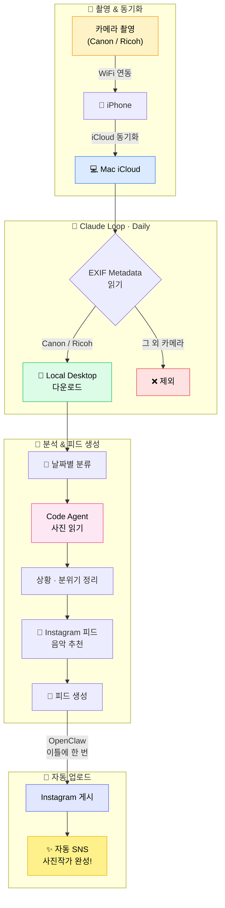

# 자동 SNS 사진작가 파이프라인

카메라로 사진만 찍으면 Instagram 피드까지 자동으로 올라가는 파이프라인입니다.

## 전체 흐름도

## 단계별 상세

| 단계 | 도구 | 역할 |
|------|------|------|
| 1️⃣ 촬영 | Canon / Ricoh 카메라 | 사진 촬영 후 WiFi로 iPhone에 자동 전송 |
| 2️⃣ 동기화 | iCloud | iPhone → Mac으로 사진 자동 동기화 |
| 3️⃣ 필터링 | **Claude `/loop`** (Daily) | EXIF Metadata 검사 → Canon/Ricoh 사진만 로컬로 이동 |
| 4️⃣ 분류 | 파일 시스템 | 촬영 날짜 기준으로 폴더 분류 |
| 5️⃣ 분석 | Code Agent | 사진의 상황·분위기 해석 |
| 6️⃣ 큐레이션 | Code Agent | 분위기에 맞는 음악 추천 + 피드 문구 생성 |
| 7️⃣ 게시 | **OpenClaw** (2일 주기) | Instagram에 피드 자동 업로드 |

## 핵심 자동화 포인트

- **EXIF 필터**: `Make` 태그가 `Canon` 또는 `RICOH`인 사진만 선별 → 휴대폰 사진은 자동 제외
- **Claude Loop**: 매일 1회 실행되는 백그라운드 루틴
- **OpenClaw 스케줄러**: 격일 게시로 피드 밀도 조절
